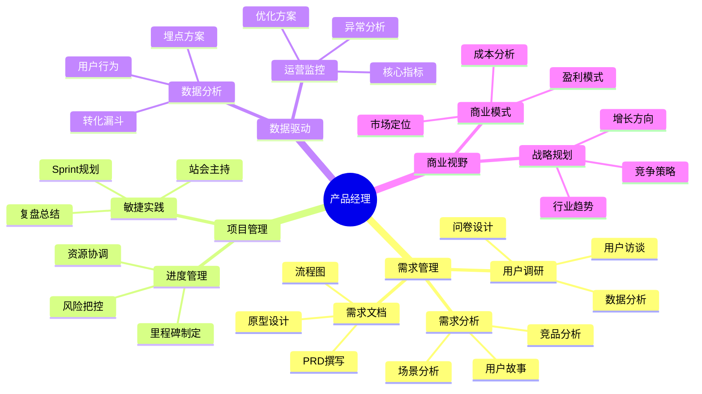

## 技能图谱

## 🎯 岗位介绍

产品经理是连接技术、业务和用户的桥梁，负责产品的整个生命周期管理。

## 💡 核心技能

### 入门阶段

1. **需求管理能力**
   - 用户调研与需求收集
   - PRD文档撰写
   - 原型设计（Axure/Figma）
   - 基础数据分析

2. **沟通协作能力**
   - 跨部门沟通
   - 需求评审主持
   - 用户反馈处理

### 进阶阶段

1. **项目管理能力**
   - 敏捷开发实践
   - 项目进度把控
   - 风险预估与管理

2. **数据分析能力**
   - 数据埋点设计
   - 用户行为分析
   - AB测试设计

3. **商业思维**
   - 商业模式分析
   - 市场竞争分析
   - 战略规划能力

## 📚 学习资源

1. **入门课程**
   - 《人人都是产品经理》
   - 《产品方法论》
   - Axure/Figma基础教程

2. **进阶资源**
   - 《增长黑客》
   - 《商业模式新生代》
   - 《精益数据分析》

## 🛠️ 必备工具

1. **原型设计**
   - Axure RP
   - Figma
   - Sketch

2. **数据分析**
   - Google Analytics
   - Mixpanel
   - Tableau

3. **项目管理**
   - JIRA
   - Trello
   - Confluence

## 📈 职业发展

### 发展路径

1. 助理产品经理（0-1年）
2. 产品经理（1-3年）
3. 高级产品经理（3-5年）
4. 产品总监（5年+）

## 🎯 转型建议

1. **打好基础**
   - 系统学习产品知识体系
   - 积累实际项目经验
   - 建立数据分析思维

2. **选择方向**
   - To B/To C产品
   - 行业垂直领域
   - 创新型/稳定型产品

3. **持续成长**
   - 关注行业动态
   - 参与产品社群
   - 建立个人品牌
