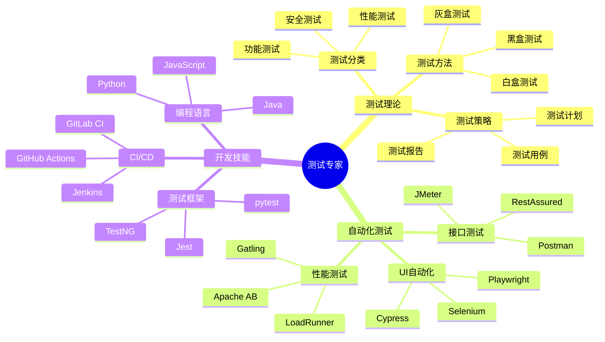

## 技能图谱

## 🎯 岗位介绍

测试专家负责保障产品质量，通过各种测试手段发现问题并推动解决，同时建设测试体系和工具平台。

## 💡 核心技能

### 入门阶段

1. **基础测试能力**
   - 测试用例设计
   - 缺陷管理
   - 测试报告编写
   - 基础编程能力

2. **工具使用能力**
   - 测试管理工具
   - 自动化测试工具
   - 性能测试工具

### 进阶阶段

1. **自动化测试能力**
   - 测试框架开发
   - 持续集成实践
   - 测试平台建设

2. **专项测试能力**
   - 性能测试
   - 安全测试
   - 兼容性测试

3. **技术架构能力**
   - 测试架构设计
   - 测试平台规划
   - 效能度量体系

## 📚 学习资源

1. **入门课程**
   - 《软件测试的艺术》
   - 《Python自动化测试实战》
   - Selenium WebDriver实战教程

2. **进阶资源**
   - 《持续测试》
   - 《Google软件测试之道》
   - 《性能测试实战》

## 🛠️ 必备工具

1. **测试管理**
   - JIRA
   - TestRail
   - Zentao

2. **自动化测试**
   - Selenium
   - Cypress
   - JMeter

3. **持续集成**
   - Jenkins
   - GitLab CI
   - Docker

## 📈 职业发展

### 发展路径

1. 初级测试工程师（0-2年）
2. 高级测试工程师（2-4年）
3. 测试架构师（4-6年）
4. 测试总监（6年+）

## 🎯 转型建议

1. **技术积累**
   - 掌握一门编程语言
   - 熟悉自动化测试框架
   - 了解持续集成流程

2. **方向选择**
   - 功能测试
   - 性能测试
   - 安全测试
   - 自动化测试

3. **持续进阶**
   - 参与开源项目
   - 建设测试平台
   - 技术社区分享
