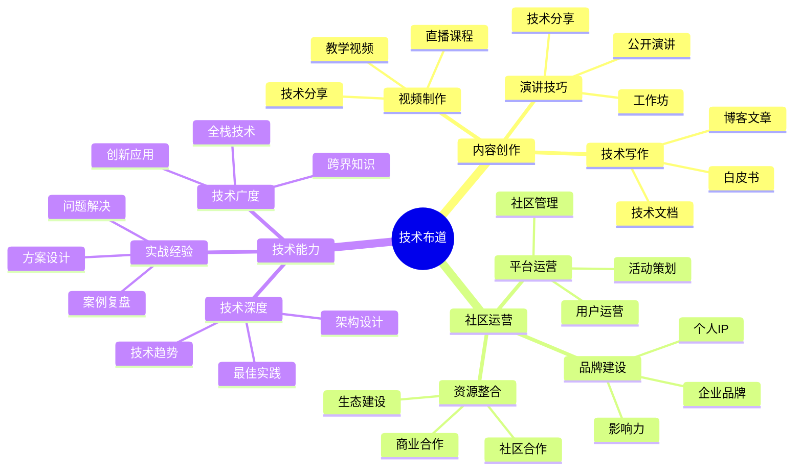

## 技能图谱

## 🎯 岗位介绍

技术布道师负责传播技术理念、分享技术知识、建设开发者社区，是连接技术与人的桥梁。

## 💡 核心技能

### 入门阶段

1. **内容创作能力**
   - 技术文档写作
   - 技术博客创作
   - 视频内容制作
   - 演讲表达能力

2. **技术基础**
   - 技术领域专长
   - 案例实践经验
   - 问题解决能力

### 进阶阶段

1. **社区运营**
   - 社区管理
   - 活动策划
   - 用户运营

2. **品牌建设**
   - 个人IP打造
   - 影响力建设
   - 商业价值转化

3. **生态建设**
   - 资源整合
   - 合作拓展
   - 生态共建

## 📚 学习资源

1. **入门课程**
   - 《技术写作指南》
   - 《演讲的力量》
   - 《社区运营实战》

2. **进阶资源**
   - 《影响力》
   - 《内容营销》
   - 《品牌建设》

## 🛠️ 必备工具

1. **内容创作**
   - Markdown编辑器
   - 视频剪辑软件
   - 图文创作工具

2. **社区运营**
   - 社区管理平台
   - 数据分析工具
   - 运营管理工具

3. **品牌建设**
   - 社交媒体平台
   - 直播工具
   - 设计工具

## 📈 职业发展

### 发展路径

1. 技术作者（0-2年）
2. 技术布道师（2-4年）
3. 开发者关系（4-6年）
4. 技术社区负责人（6年+）

## 🎯 转型建议

1. **内容积累**
   - 建立知识体系
   - 形成内容矩阵
   - 打造个人品牌

2. **方向选择**
   - 技术写作
   - 视频创作
   - 技术演讲
   - 社区运营

3. **持续成长**
   - 扩展技术视野
   - 提升影响力
   - 商业价值转化
