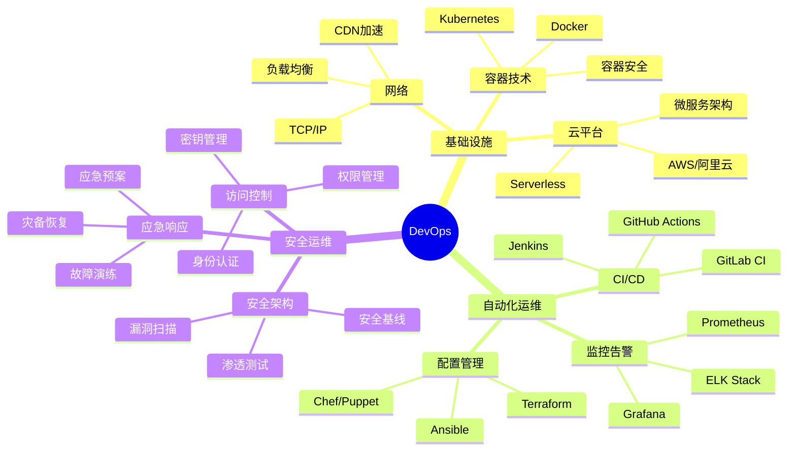

## 技能图谱

## 🎯 岗位介绍

DevOps工程师负责构建和维护自动化的软件交付和基础设施管理流程，促进开发和运维的协作，确保系统的可靠性和安全性。

## 💡 核心技能

### 入门阶段

1. **基础运维能力**
   - Linux系统管理
   - Shell脚本编写
   - 基础网络知识
   - 容器技术（Docker）

2. **自动化工具使用**
   - CI/CD工具
   - 配置管理工具
   - 监控工具

### 进阶阶段

1. **云原生技术**
   - Kubernetes集群管理
   - 微服务架构
   - Serverless架构

2. **自动化运维**
   - 自动化部署
   - 自动化测试
   - 自动化运维

3. **架构设计能力**
   - 高可用架构
   - 容灾架构
   - 安全架构

## 📚 学习资源

1. **入门课程**
   - 《Docker实战》
   - 《Kubernetes权威指南》
   - 《DevOps实践指南》

2. **进阶资源**
   - 《SRE: Google运维解密》
   - 《云原生架构》
   - 《凤凰项目》

## 🛠️ 必备工具

1. **容器编排**
   - Docker
   - Kubernetes
   - Rancher

2. **CI/CD**
   - Jenkins
   - GitLab CI
   - ArgoCD

3. **监控告警**
   - Prometheus
   - Grafana
   - ELK Stack

## 📈 职业发展

### 发展路径
1. 运维工程师（0-2年）
2. DevOps工程师（2-4年）
3. 高级DevOps工程师（4-6年）
4. 架构师（6年+）

### 薪资范围
- 初级：12-25K
- 中级：25-40K
- 高级：40-60K
- 架构师：60K+

## 🎯 转型建议

1. **技术积累**
   - 掌握Linux系统管理
   - 学习容器技术
   - 熟悉CI/CD流程

2. **方向选择**
   - 云原生方向
   - 自动化运维
   - SRE方向

3. **持续成长**
   - 参与开源项目
   - 构建自动化平台
   - 技术社区交流 