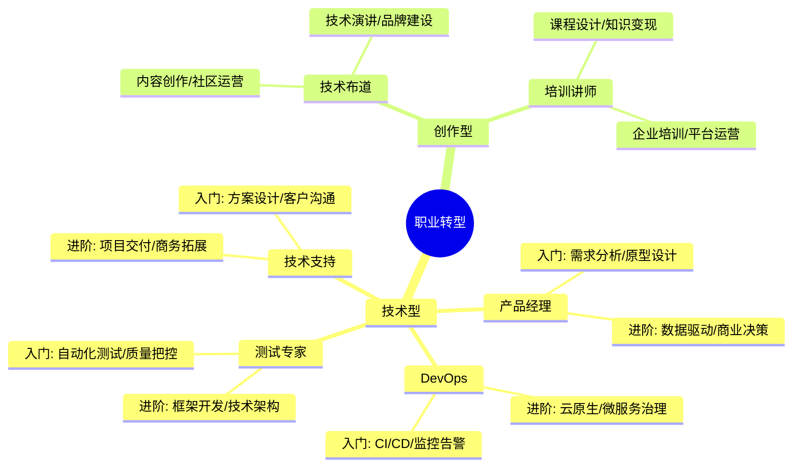

## 🎯 转型路线一览

## 🧭 职业导航

### 技术型转型

- [产品经理](./product-manager.md) - 连接技术与业务的桥梁
- [测试专家](./test-expert.md) - 守护产品质量的卫士
- [DevOps](./devops.md) - 自动化运维的实践者
- [技术支持](./tech-support.md) - 技术服务的专家

### 创作型转型

- [技术布道](./tech-evangelist.md) - 技术传播的使者
- [培训讲师](./trainer.md) - 知识分享的引路人

## 💡 快速开始

### 技术型转型

1. **[产品经理](./product-manager.md)**
   - 入门：需求文档、原型设计、数据分析
   - 进阶：商业决策、团队管理、战略规划

2. **[测试专家](./test-expert.md)**
   - 入门：自动化测试、性能测试、质量监控
   - 进阶：框架开发、DevOps集成、团队赋能

3. **[DevOps](./devops.md)**
   - 入门：CI/CD、容器化、监控告警
   - 进阶：云原生架构、安全合规、技术选型

4. **[技术支持](./tech-support.md)**
   - 入门：方案设计、技术支持、客户沟通
   - 进阶：项目交付、商务拓展、品牌建设

### 创作型转型

1. **[技术布道](./tech-evangelist.md)**
   - 内容创作：技术文章、视频制作、社区运营
   - 品牌建设：技术演讲、书籍出版、影响力打造

2. **[培训讲师](./trainer.md)**
   - 知识付费：课程设计、直播培训、社群运营
   - 企业培训：内训定制、咨询服务、平台合作

## 🌟 成功要素

- **持续学习**: 保持对新技术的敏感度
- **跨界思维**: 培养多维度解决问题能力
- **沟通协作**: 提升团队协作和表达能力
- **商业意识**: 理解业务价值和市场需求

## 📈 发展建议

1. 选择**感兴趣**且**市场需求大**的方向
2. 制定**清晰的阶段性目标**
3. 通过**实战项目**积累经验
4. 建立个人**品牌影响力**
