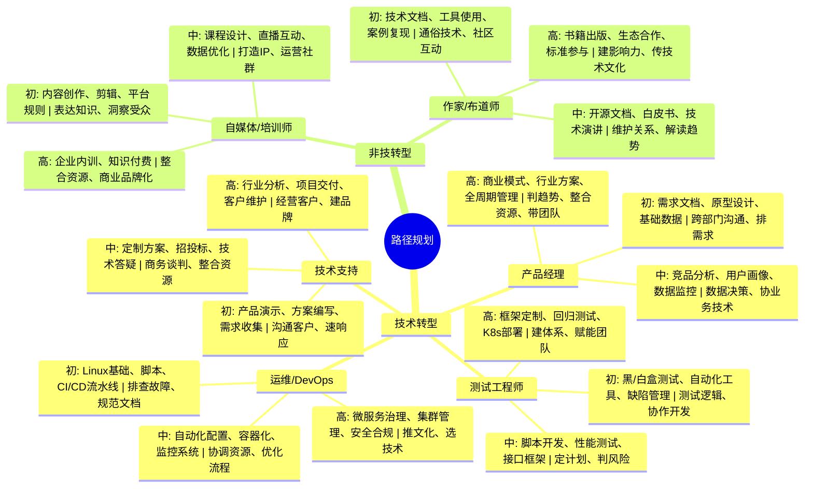

## 思维导图

## 路径

1. **技术相关转型**  
   - **产品经理**：需业务理解力、用户需求分析、原型设计能力。  
   - **测试工程师**：掌握自动化测试工具（如Selenium）、白盒测试技术。  
   - **运维/DevOps**：熟悉容器化（Docker/K8s）、CI/CD流程。  
   - **售前/售后技术支持**：技术方案输出能力，客户沟通技巧。  
2. **非技术转型**  
   - **技术自媒体/培训师**：内容创作能力，知识输出与表达能力。  
   - **技术作家/布道师**：技术文档撰写、社区影响力建设。

## 关键能力

### **一、技术相关转型**

#### **1. 产品经理**

- **初级阶段（执行型）**  
  - **硬技能**：需求文档编写、Axure原型设计、基础数据分析。  
  - **软技能**：跨部门沟通、需求优先级排序、避免技术思维主导产品设计。  
- **中级阶段（参考型/运营型）**  
  - **硬技能**：竞品分析、用户画像构建、数据埋点与运营监控。  
  - **软技能**：用数据驱动决策、平衡业务与技术诉求、推动跨团队协作。  
- **高级阶段（创新型/战略型）**  
  - **硬技能**：商业模式设计、行业解决方案输出、产品全生命周期管理。  
  - **软技能**：市场趋势预判、资源整合能力、团队领导力。

#### **2. 测试工程师**

- **初级阶段**  
  - **硬技能**：黑盒/白盒测试、Selenium自动化工具、缺陷管理流程。  
  - **软技能**：测试用例设计逻辑性、开发团队协作。  
- **中级阶段**  
  - **硬技能**：Python/Java脚本开发、性能测试（JMeter）、接口测试框架。  
  - **软技能**：测试计划制定、风险预判与报告撰写。  
- **高级阶段**  
  - **硬技能**：自动化测试框架定制、精准回归测试、K8s环境部署。  
  - **软技能**：测试左移/右移体系建设、团队技术赋能。

#### **3. 运维/DevOps**

- **初级阶段**  
  - **硬技能**：Linux基础、Shell脚本、Jenkins CI/CD流水线。  
  - **软技能**：故障排查流程、文档规范化。  
- **中级阶段**  
  - **硬技能**：Ansible自动化配置、Docker容器化、监控系统（Prometheus）。  
  - **软技能**：跨部门资源协调、运维流程优化。  
- **高级阶段**  
  - **硬技能**：微服务架构治理、云原生（K8s）集群管理、安全合规设计。  
  - **软技能**：DevOps文化推广、技术选型决策。

#### **4. 售前/售后技术支持**

- **初级阶段**  
  - **硬技能**：产品功能演示、基础技术方案编写、客户需求收集。  
  - **软技能**：客户沟通技巧、问题快速响应。  
- **中级阶段**  
  - **硬技能**：定制化解决方案设计、招投标文件撰写、技术答疑。  
  - **软技能**：商务谈判能力、跨部门资源整合。  
- **高级阶段**  
  - **硬技能**：行业趋势分析、复杂项目交付管理、客户关系维护。  
  - **软技能**：战略客户经营、技术品牌建设。

---

### **二、非技术转型**

#### **1. 技术自媒体/培训师**

- **初级阶段**  
  - **硬技能**：内容创作（图文/视频）、基础剪辑工具、平台运营规则。  
  - **软技能**：知识结构化表达、受众需求洞察。  
- **中级阶段**  
  - **硬技能**：课程体系设计、直播互动技巧、数据分析优化内容。  
  - **软技能**：IP人设打造、社群运营。  
- **高级阶段**  
  - **硬技能**：企业内训定制、知识付费产品开发。  
  - **软技能**：行业资源整合、品牌商业化。

#### **2. 技术作家/布道师**

- **初级阶段**  
  - **硬技能**：技术文档撰写、Markdown/Git工具、案例复现。  
  - **软技能**：技术概念通俗化、社区基础互动。  
- **中级阶段**  
  - **硬技能**：开源项目文档维护、技术白皮书编写、技术大会演讲。  
  - **软技能**：开发者关系维护、技术趋势解读。  
- **高级阶段**  
  - **硬技能**：技术书籍出版、生态合作推动、标准制定参与。  
  - **软技能**：行业影响力建设、技术文化传播。

---

### **关键要点**

- **硬技能**侧重工具使用与技术深度，需通过项目实践持续迭代。  
- **软技能**包括沟通、协作与战略思维，需结合场景刻意练习。  
- 转型需关注行业动态（如AI对测试自动化的影响），保持终身学习。
