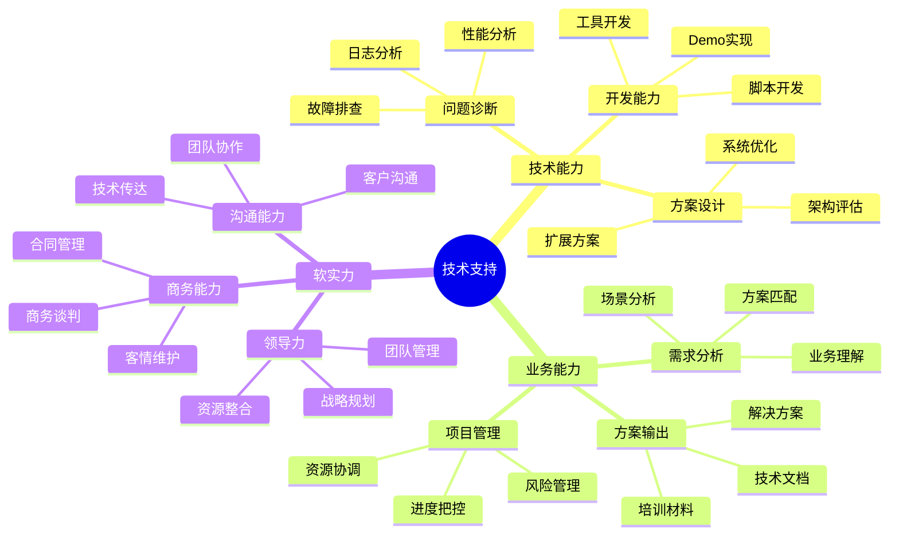

## 技能图谱

## 🎯 岗位介绍

技术支持工程师是连接产品、客户和研发的桥梁，负责解决客户技术问题，提供技术方案，确保客户成功。

## 💡 核心技能

### 入门阶段

1. **技术基础**
   - 产品功能掌握
   - 问题诊断能力
   - 文档编写能力
   - 基础编程能力

2. **沟通能力**
   - 客户沟通技巧
   - 问题理解能力
   - 方案表达能力

### 进阶阶段

1. **方案能力**
   - 架构设计
   - 性能优化
   - 系统集成

2. **项目管理**
   - 项目规划
   - 风险管理
   - 资源协调

3. **商务能力**
   - 商务谈判
   - 客户关系
   - 合同管理

## 📚 学习资源

1. **入门课程**
   - 《技术支持工程师修炼之道》
   - 《高效沟通技巧》
   - 《问题分析与解决》

2. **进阶资源**
   - 《架构设计实战》
   - 《项目管理知识体系》
   - 《商务谈判技巧》

## 🛠️ 必备工具

1. **问题诊断**
   - 性能监控工具
   - 日志分析工具
   - 网络分析工具

2. **方案设计**
   - 架构设计工具
   - 原型设计工具
   - 文档协作工具

3. **项目管理**
   - JIRA
   - Confluence
   - Project

## 📈 职业发展

### 发展路径
1. 初级技术支持（0-2年）
2. 高级技术支持（2-4年）
3. 技术支持经理（4-6年）
4. 技术总监（6年+）

### 薪资范围
- 初级：10-20K
- 中级：20-35K
- 高级：35-50K
- 总监：50K+

## 🎯 转型建议

1. **技术积累**
   - 深入产品技术
   - 掌握问题诊断
   - 提升方案能力

2. **方向选择**
   - 售前技术支持
   - 售后技术支持
   - 解决方案架构师

3. **持续成长**
   - 建立知识体系
   - 积累案例经验
   - 拓展行业视野 