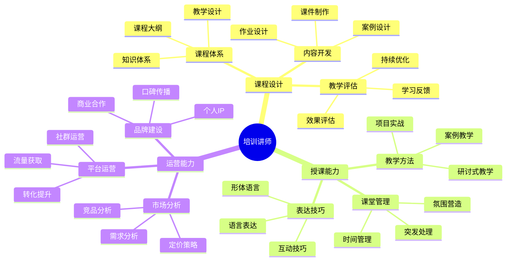

## 技能图谱

## 🎯 岗位介绍

培训讲师负责技术知识的传授和分享，通过线上线下课程帮助学习者掌握技能，实现职业提升。

## 💡 核心技能

### 入门阶段

1. **教学能力**
   - 课程设计
   - 课件制作
   - 表达技巧
   - 互动技巧

2. **技术功底**
   - 专业领域知识
   - 实战经验
   - 案例积累

### 进阶阶段

1. **课程体系**
   - 体系设计
   - 内容开发
   - 教学评估

2. **运营能力**
   - 社群运营
   - 用户增长
   - 品牌建设

3. **商业能力**
   - 市场分析
   - 商业模式
   - 合作拓展

## 📚 学习资源

1. **入门课程**
   - 《教学设计》
   - 《演讲与口才》
   - 《课程开发指南》

2. **进阶资源**
   - 《知识付费》
   - 《社群运营》
   - 《在线教育》

## 🛠️ 必备工具

1. **课程制作**
   - PPT
   - Keynote
   - 思维导图工具

2. **在线教学**
   - 直播平台
   - 录课工具
   - 在线互动工具

3. **运营工具**
   - 社群管理工具
   - 数据分析工具
   - CRM系统

## 📈 职业发展

### 发展路径
1. 助教（0-1年）
2. 讲师（1-3年）
3. 高级讲师（3-5年）
4. 教学总监（5年+）

### 薪资范围
- 初级：10-20K
- 中级：20-40K
- 高级：40-80K
- 总监：80K+

## 🎯 转型建议

1. **能力培养**
   - 提升专业能力
   - 锻炼表达能力
   - 积累实战经验

2. **方向选择**
   - 企业内训
   - 在线教育
   - 职业培训
   - 技术社群

3. **持续成长**
   - 扩展知识领域
   - 打造个人品牌
   - 建立商业模式 