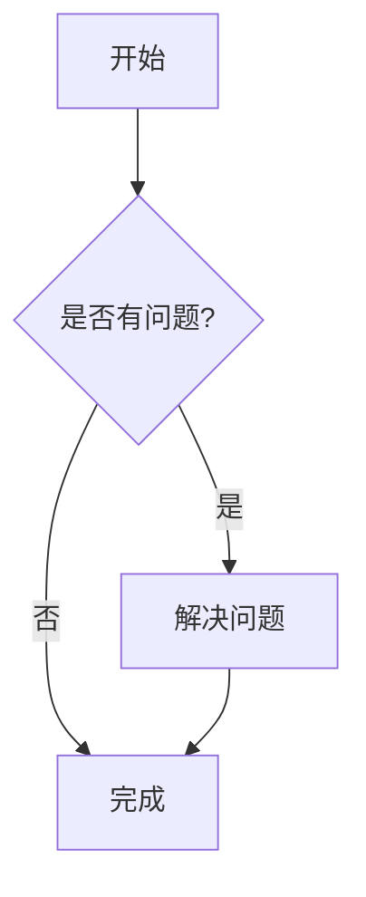
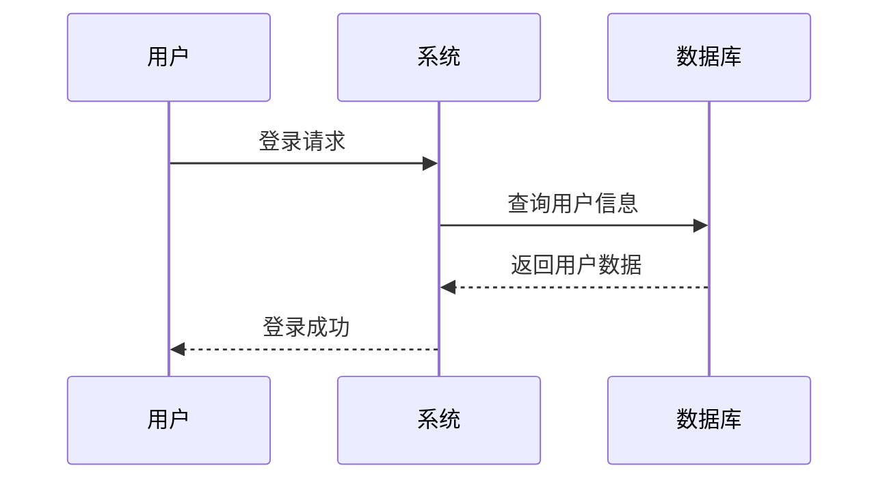
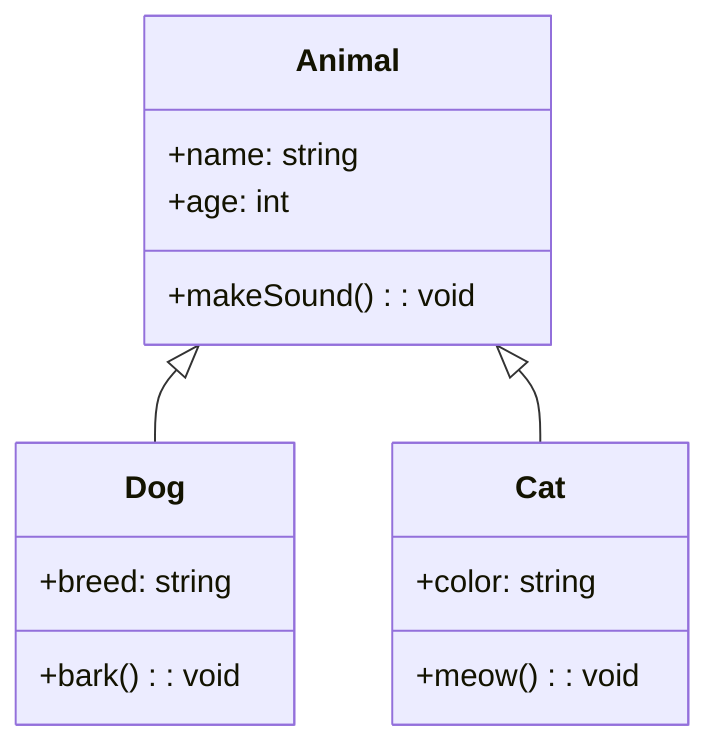
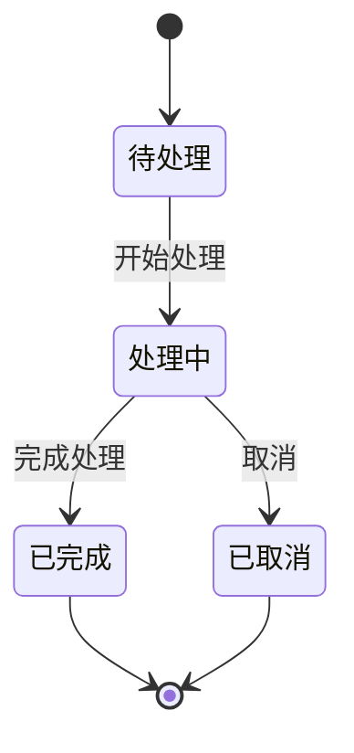
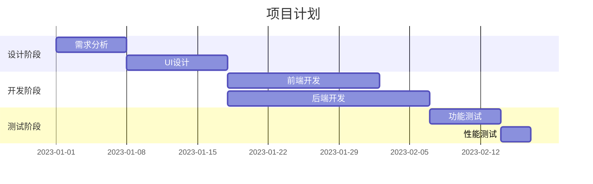
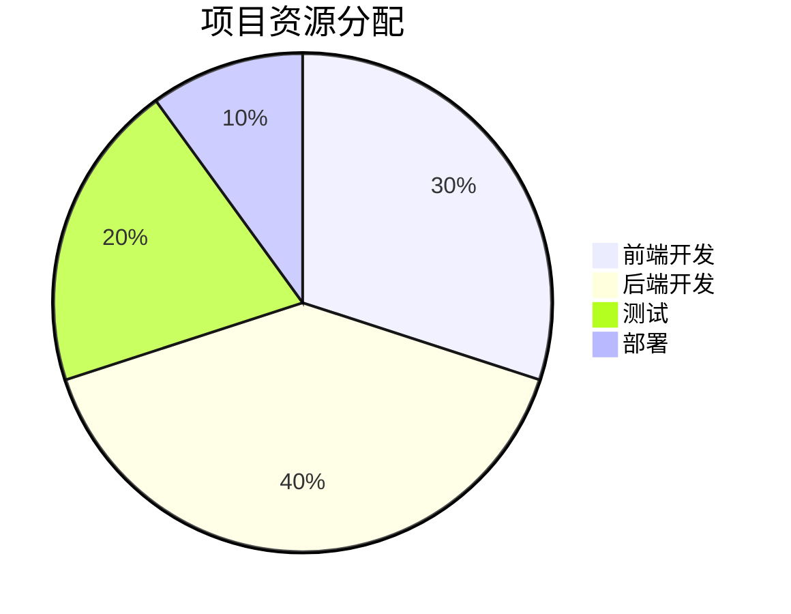
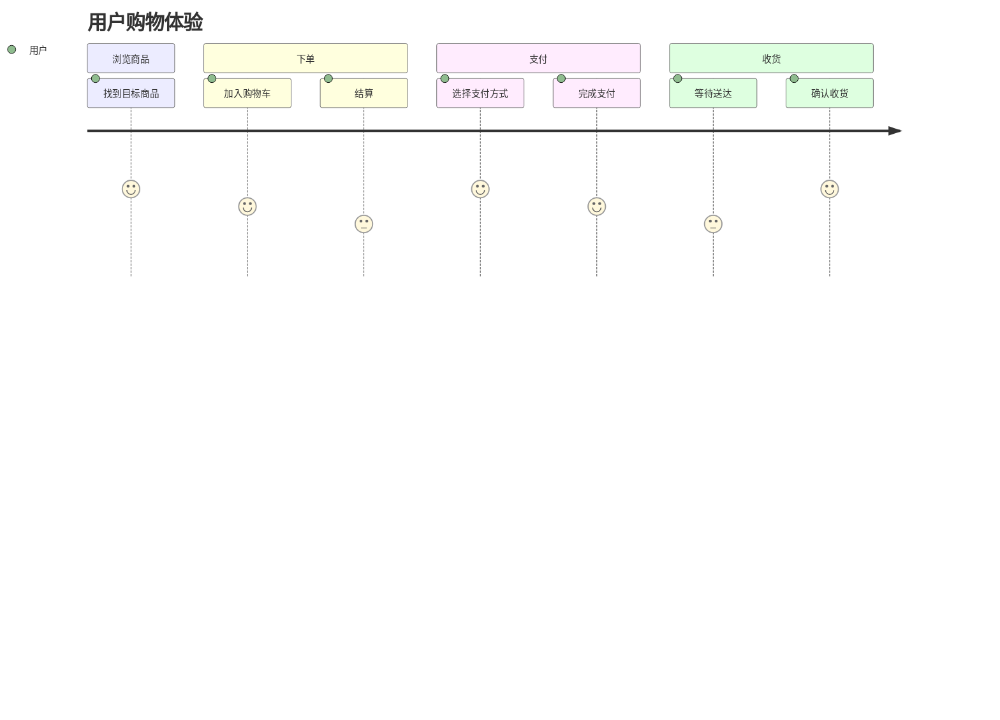
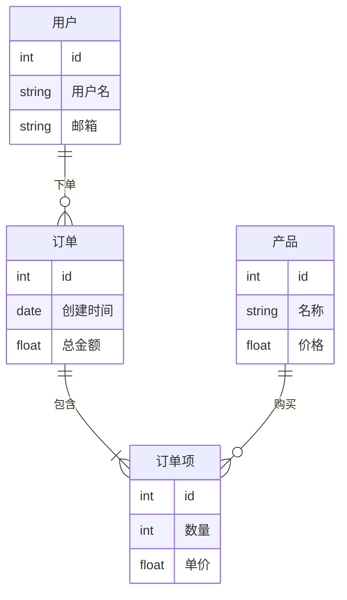

# Mermaid 图表示例

本页面展示了使用 Mermaid 创建的各种图表示例。

## 流程图

```mermaid
graph TD
    A[开始] --> B{是否有问题?}
    B -->|是| C[解决问题]
    B -->|否| D[完成]
    C --> D
```

## 时序图

```mermaid
sequenceDiagram
    participant 用户
    participant 系统
    participant 数据库
    
    用户->>系统: 登录请求
    系统->>数据库: 查询用户信息
    数据库-->>系统: 返回用户数据
    系统-->>用户: 登录成功
```

## 类图

```mermaid
classDiagram
    class Animal {
        +name: string
        +age: int
        +makeSound(): void
    }
    class Dog {
        +breed: string
        +bark(): void
    }
    class Cat {
        +color: string
        +meow(): void
    }
    Animal <|-- Dog
    Animal <|-- Cat
```

## 状态图

```mermaid
stateDiagram-v2
    [*] --> 待处理
    待处理 --> 处理中: 开始处理
    处理中 --> 已完成: 完成处理
    处理中 --> 已取消: 取消
    已完成 --> [*]
    已取消 --> [*]
```

## 甘特图

```mermaid
gantt
    title 项目计划
    dateFormat  YYYY-MM-DD
    section 设计阶段
    需求分析    :a1, 2023-01-01, 7d
    UI设计     :a2, after a1, 10d
    section 开发阶段
    前端开发    :a3, after a2, 15d
    后端开发    :a4, after a2, 20d
    section 测试阶段
    功能测试    :a5, after a4, 7d
    性能测试    :a6, after a5, 3d
```

## 饼图

```mermaid
pie title 项目资源分配
    "前端开发" : 30
    "后端开发" : 40
    "测试" : 20
    "部署" : 10
```

## 用户旅程图

```mermaid
journey
    title 用户购物体验
    section 浏览商品
      找到目标商品: 5: 用户
    section 下单
      加入购物车: 4: 用户
      结算: 3: 用户
    section 支付
      选择支付方式: 5: 用户
      完成支付: 4: 用户
    section 收货
      等待送达: 3: 用户
      确认收货: 5: 用户
```

## ER 图

```mermaid
erDiagram
    用户 ||--o{ 订单 : 下单
    订单 ||--|{ 订单项 : 包含
    产品 ||--o{ 订单项 : 购买
    
    用户 {
        int id
        string 用户名
        string 邮箱
    }
    订单 {
        int id
        date 创建时间
        float 总金额
    }
    订单项 {
        int id
        int 数量
        float 单价
    }
    产品 {
        int id
        string 名称
        float 价格
    }
``` 