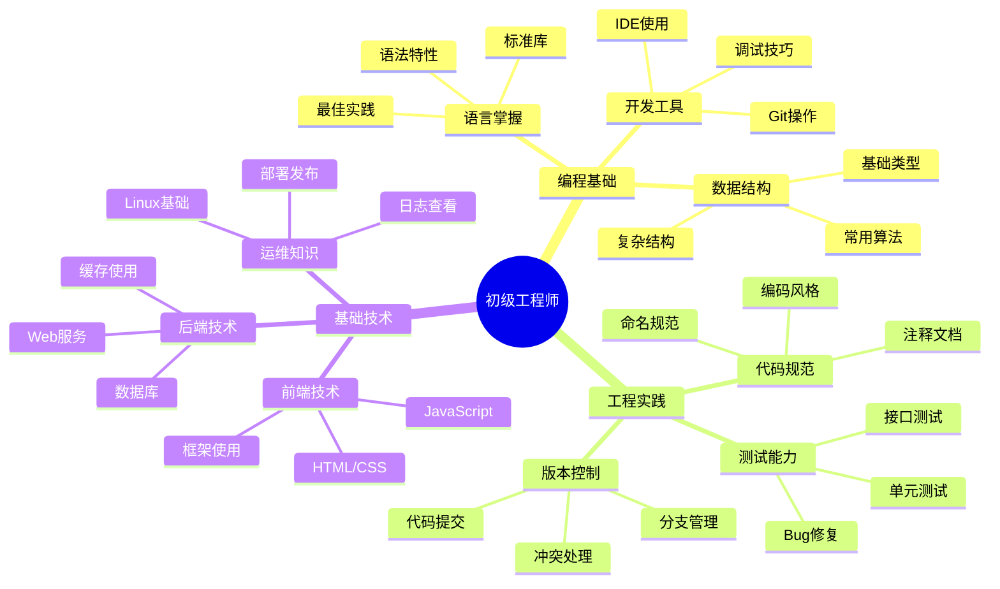

## 技能图谱

## 🎯 岗位介绍

初级工程师是技术生涯的起点，主要负责基础功能开发，培养编程思维和工程实践能力。

## 💡 核心技能

### 基础能力

1. **编程语言**
   - 掌握一门主流语言
   - 理解基础语法特性
   - 熟悉标准库使用
   - 编写规范代码

2. **开发工具**
   - IDE熟练使用
   - Git基础操作
   - 调试工具应用
   - 文档工具使用

### 工程实践

1. **代码开发**
   - 功能模块实现
   - 单元测试编写
   - Bug修复能力
   - 代码审查参与

2. **团队协作**
   - 任务进度汇报
   - 技术文档编写
   - 代码版本管理
   - 团队交流沟通

## 📚 学习资源

1. **入门课程**
   - 《编程语言基础》
   - 《数据结构与算法》
   - 《Git版本控制》

2. **进阶资源**
   - 《代码整洁之道》
   - 《程序员修炼之道》
   - 《重构：改善既有代码》

## 🛠️ 必备工具

1. **开发环境**
   - VSCode/IDEA
   - Git
   - Postman

2. **辅助工具**
   - Chrome DevTools
   - 数据库客户端
   - 文档工具

3. **学习平台**
   - GitHub
   - Stack Overflow
   - LeetCode

## 📈 职业发展

### 发展路径
1. 实习生（0-6月）
2. 初级工程师（6月-2年）
3. 中级工程师（2年+）

### 能力指标
- 基础：独立完成简单功能
- 进阶：解决常见技术问题
- 提升：参与复杂功能开发

## 🎯 成长建议

1. **技术积累**
   - 打牢编程基础
   - 多写代码练手
   - 阅读优质代码

2. **能力培养**
   - 培养编程思维
   - 提升工程能力
   - 加强问题分析

3. **习惯养成**
   - 编写单元测试
   - 及时代码审查
   - 写技术博客 