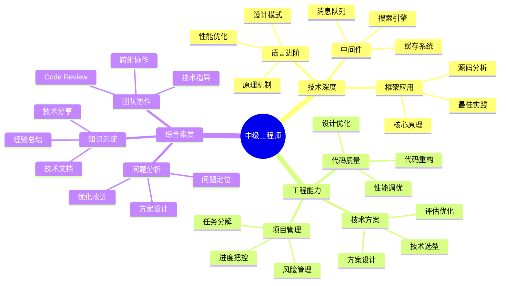

## 技能图谱

## 🎯 岗位介绍

中级工程师是技术深度提升的关键阶段，需要在技术广度和深度上都有所建树，能够独立完成复杂功能模块的开发。

## 💡 核心技能

### 技术能力

1. **技术深度**
   - 语言特性深入理解
   - 框架原理掌握
   - 性能优化能力
   - 设计模式应用

2. **工程实践**
   - 代码重构能力
   - 技术方案设计
   - 性能问题诊断
   - 架构意识培养

### 综合能力

1. **项目管理**
   - 需求分析能力
   - 任务拆解规划
   - 进度风险把控
   - 团队协作配合

2. **问题解决**
   - 技术难题攻克
   - 性能瓶颈优化
   - 故障排查定位
   - 方案优化改进

## 📚 学习资源

1. **技术提升**
   - 《深入理解XX语言》
   - 《设计模式》
   - 《重构与模式》

2. **工程实践**
   - 《架构整洁之道》
   - 《系统设计面试》
   - 《高性能XX实战》

## 🛠️ 必备工具

1. **开发工具**
   - 性能分析工具
   - 调试工具链
   - 监控平台

2. **效率工具**
   - 项目管理工具
   - 文档协作平台
   - 代码审查工具

3. **分析工具**
   - 性能测试工具
   - 压测平台
   - 监控告警系统

## 📈 职业发展

### 发展路径
1. 中级工程师（2-4年）
2. 高级工程师（4-6年）
3. 技术专家（6年+）

### 能力指标
- 基础：独立负责模块开发
- 进阶：解决技术难题
- 提升：指导初级工程师

## 🎯 成长建议

1. **技术提升**
   - 深入技术原理
   - 源码阅读分析
   - 性能优化实践

2. **能力培养**
   - 培养架构思维
   - 提升方案能力
   - 加强团队协作

3. **经验积累**
   - 总结技术文档
   - 分享技术经验
   - 指导新人成长 