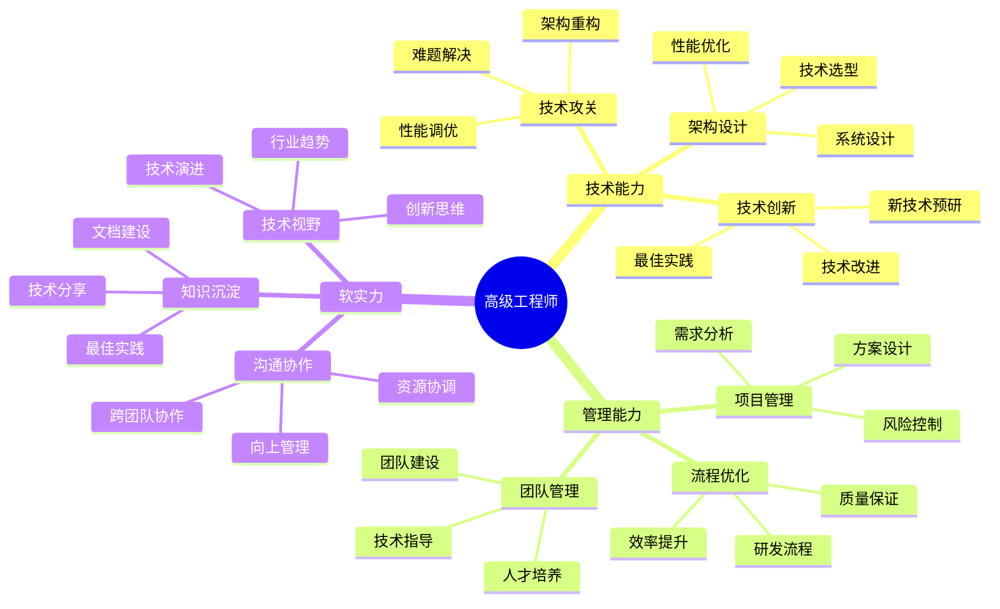

## 技能图谱

## 🎯 岗位介绍

高级工程师是技术团队的核心力量，负责关键技术方案设计、疑难问题攻关，并指导团队成员成长。

## 💡 核心技能

### 技术能力

1. **架构设计**
   - 系统架构设计
   - 技术方案评估
   - 性能优化方案
   - 技术选型决策

2. **技术攻关**
   - 疑难问题解决
   - 性能瓶颈突破
   - 架构优化改进
   - 技术创新应用

### 管理能力

1. **团队管理**
   - 技术团队指导
   - 新人培养辅导
   - 技术氛围营造
   - 团队效能提升

2. **项目管理**
   - 技术方案设计
   - 项目进度把控
   - 风险评估管理
   - 质量保证体系

## 📚 学习资源

1. **技术提升**
   - 《系统架构设计》
   - 《分布式系统原理》
   - 《高性能系统设计》

2. **管理提升**
   - 《技术管理之道》
   - 《OKR工作法》
   - 《高效能人士的七个习惯》

## 🛠️ 必备工具

1. **架构工具**
   - 架构设计工具
   - 性能分析平台
   - 监控告警系统

2. **管理工具**
   - 项目管理平台
   - 团队协作工具
   - 文档管理系统

3. **开发工具**
   - 自动化测试平台
   - CI/CD工具链
   - 代码质量平台

## 📈 职业发展

### 发展路径
1. 高级工程师（4-6年）
2. 技术专家（6-8年）
3. 架构师（8年+）

### 能力指标
- 技术：系统架构设计能力
- 管理：团队技术指导能力
- 创新：技术创新与改进能力

## 🎯 成长建议

1. **技术提升**
   - 深入技术领域
   - 建立技术体系
   - 保持技术敏感度

2. **管理能力**
   - 提升团队管理
   - 加强项目把控
   - 培养商业意识

3. **影响力建设**
   - 技术分享输出
   - 团队文化建设
   - 技术品牌打造 