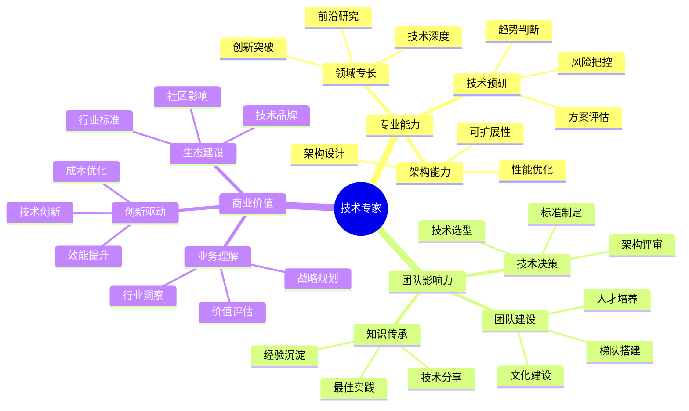

## 技能图谱

## 🎯 岗位介绍

技术专家是技术领域的深度专家，负责技术战略规划、关键技术突破和团队技术影响力建设。

## 💡 核心技能

### 专业能力

1. **技术深度**
   - 领域技术精通
   - 前沿技术研究
   - 核心技术攻关
   - 架构设计能力

2. **技术创新**
   - 技术方向判断
   - 创新方案设计
   - 技术难题突破
   - 最佳实践沉淀

### 领导力

1. **团队建设**
   - 技术团队领导
   - 技术文化建设
   - 人才梯队培养
   - 技术影响力

2. **战略规划**
   - 技术战略制定
   - 架构演进规划
   - 技术资源配置
   - 创新方向把控

## 📚 学习资源

1. **技术提升**
   - 前沿技术论文
   - 技术会议分享
   - 行业标准规范

2. **管理提升**
   - 《技术领导力》
   - 《创新者的解答》
   - 《战略思维》

## 🛠️ 必备工具

1. **技术工具**
   - 架构设计平台
   - 性能分析系统
   - 技术评估工具

2. **管理工具**
   - 项目管理系统
   - 团队协作平台
   - 知识管理工具

3. **分析工具**
   - 数据分析平台
   - 技术评估系统
   - 创新管理工具

## 📈 职业发展

### 发展路径
1. 技术专家（6-8年）
2. 高级技术专家（8-10年）
3. 首席技术专家（10年+）

### 能力指标
- 技术：领域技术权威
- 创新：技术创新能力
- 影响：团队影响力

## 🎯 成长建议

1. **技术领先**
   - 保持技术敏锐度
   - 引领技术方向
   - 突破技术边界

2. **团队建设**
   - 打造技术文化
   - 培养技术人才
   - 建立技术影响力

3. **价值创造**
   - 技术驱动业务
   - 创新解决方案
   - 建设技术生态 