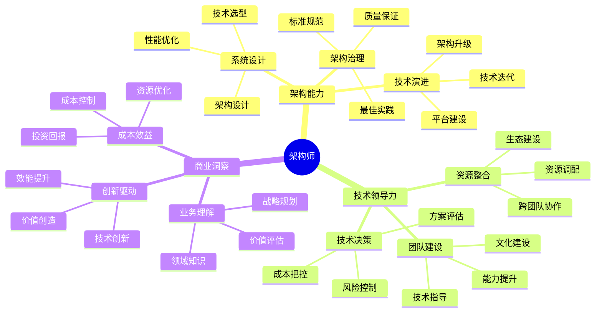

## 技能图谱

## 🎯 岗位介绍

架构师是技术体系的设计者和守护者，负责系统架构设计、技术选型决策和架构治理工作。

## 💡 核心技能

### 架构能力

1. **系统设计**
   - 架构设计能力
   - 技术选型决策
   - 性能优化方案
   - 可扩展性设计

2. **架构治理**
   - 技术标准制定
   - 最佳实践推广
   - 架构评审把控
   - 质量体系建设

### 领导力

1. **技术决策**
   - 方案评估决策
   - 技术风险控制
   - 资源成本把控
   - 技术路线规划

2. **团队建设**
   - 技术团队指导
   - 架构师培养
   - 技术文化建设
   - 跨团队协作

## 📚 学习资源

1. **技术提升**
   - 《架构整洁之道》
   - 《企业IT架构转型》
   - 《分布式系统设计》

2. **管理提升**
   - 《架构师领导力》
   - 《技术管理之道》
   - 《创新者的窘境》

## 🛠️ 必备工具

1. **架构工具**
   - 架构设计平台
   - 性能分析工具
   - 监控告警系统

2. **管理工具**
   - 项目管理平台
   - 团队协作工具
   - 文档管理系统

3. **分析工具**
   - 成本分析系统
   - 技术评估工具
   - 风险管理平台

## 📈 职业发展

### 发展路径
1. 架构师（8-10年）
2. 高级架构师（10-12年）
3. 首席架构师（12年+）

### 能力指标
- 技术：系统架构设计
- 管理：技术团队领导
- 商业：业务价值实现

## 🎯 成长建议

1. **技术提升**
   - 构建知识体系
   - 跟踪技术趋势
   - 积累实战经验

2. **管理能力**
   - 提升决策能力
   - 加强团队建设
   - 培养商业意识

3. **影响力建设**
   - 技术标准制定
   - 最佳实践推广
   - 技术生态建设 