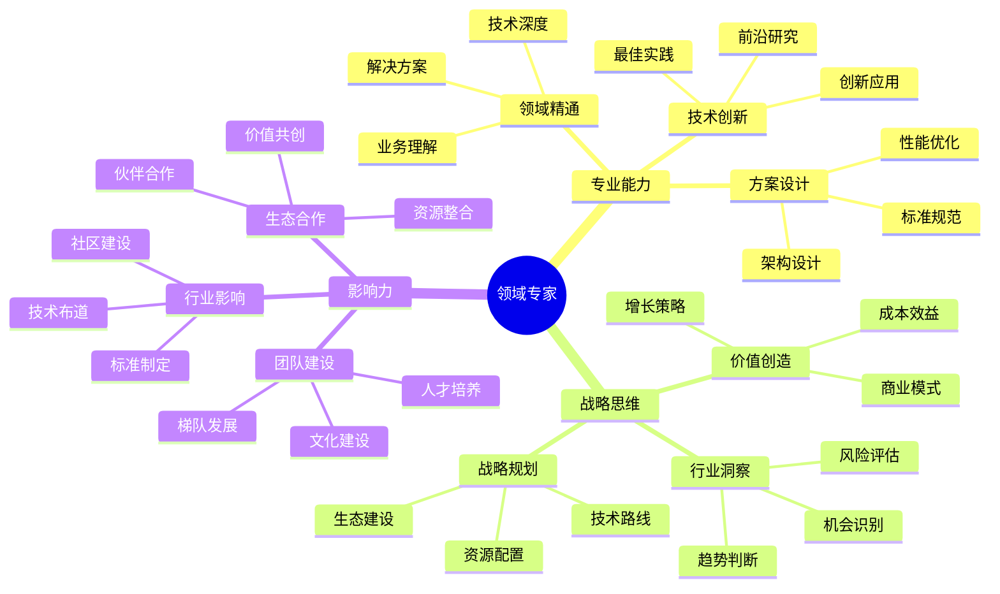

## 技能图谱

## 🎯 岗位介绍

领域专家是特定技术领域的权威，深度结合技术与业务，引领行业技术发展方向。

## 💡 核心技能

### 专业能力

1. **领域精通**
   - 业务深度理解
   - 技术体系构建
   - 解决方案设计
   - 最佳实践沉淀

2. **技术创新**
   - 前沿技术研究
   - 创新方案设计
   - 技术体系演进
   - 标准规范制定

### 战略能力

1. **行业洞察**
   - 趋势判断分析
   - 机会识别把握
   - 风险评估控制
   - 战略方向规划

2. **价值创造**
   - 商业模式创新
   - 技术价值转化
   - 生态体系建设
   - 资源整合优化

## 📚 学习资源

1. **技术提升**
   - 行业前沿论文
   - 技术标准规范
   - 解决方案集

2. **战略提升**
   - 《技术战略论》
   - 《创新者的解答》
   - 《商业模式新生代》

## 🛠️ 必备工具

1. **专业工具**
   - 技术研究平台
   - 方案设计工具
   - 标准制定系统

2. **管理工具**
   - 战略规划平台
   - 资源管理系统
   - 协作沟通工具

3. **分析工具**
   - 数据分析平台
   - 趋势分析系统
   - 价值评估工具

## 📈 职业发展

### 发展路径
1. 领域专家（10-12年）
2. 高级领域专家（12-15年）
3. 首席领域专家（15年+）

### 能力指标
- 专业：领域技术权威
- 战略：行业趋势把控
- 影响：生态体系建设

## 🎯 成长建议

1. **专业提升**
   - 深耕技术领域
   - 构建知识体系
   - 推动技术创新

2. **战略思维**
   - 培养商业洞察
   - 提升决策能力
   - 加强资源整合

3. **影响力建设**
   - 打造技术品牌
   - 建设技术社区
   - 推动行业发展 