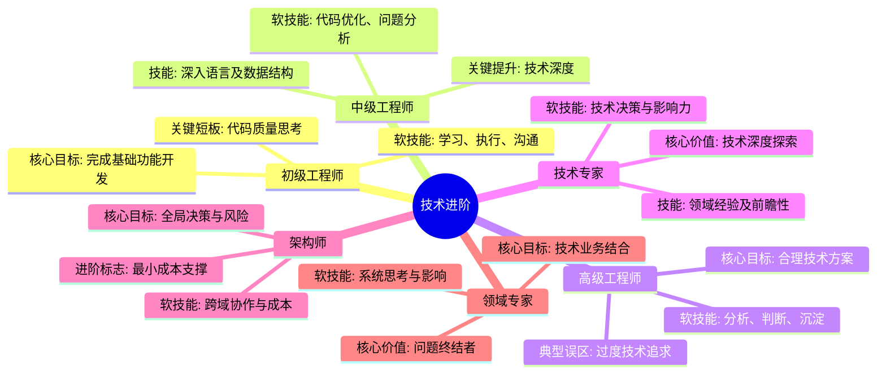

## 🎯 技术进阶路线图

## 🧭 职业导航

### 工程师进阶

- [初级工程师](./01junior-engineer.md) - 打好技术基础的起点
- [中级工程师](./02mid-engineer.md) - 技术深度的提升期
- [高级工程师](./03senior-engineer.md) - 技术方案的设计者

### 专家进阶

- [技术专家](./04tech-expert.md) - 领域技术的探索者
- [架构师](./05architect.md) - 系统架构的设计师
- [领域专家](./06domain-expert.md) - 技术与业务的融合者

## 💡 核心能力要求

### 工程师阶段

1. **初级工程师**
   - 掌握基础编程语言
   - 熟悉开发工具链
   - 实现基础功能模块

2. **中级工程师**
   - 深入理解技术原理
   - 独立完成复杂功能
   - 具备代码优化能力

3. **高级工程师**
   - 主导技术方案设计
   - 解决关键技术难题
   - 指导初中级工程师

### 专家阶段

1. **技术专家**
   - 领域技术深度研究
   - 前沿技术预研评估
   - 技术难题终结者

2. **架构师**
   - 系统架构规划设计
   - 技术选型与风险把控
   - 性能优化与成本控制

3. **领域专家**
   - 技术战略规划能力
   - 业务价值实现能力
   - 团队技术影响力

## 🌟 成功要素

- **技术视野**: 持续跟进技术前沿
- **业务理解**: 深入理解业务价值
- **系统思维**: 建立完整知识体系
- **团队协作**: 提升团队技术能力

## 📈 发展建议

1. **技术积累**
   - 构建知识体系
   - 参与开源项目
   - 技术专利/论文

2. **能力培养**
   - 技术方案设计
   - 架构设计能力
   - 技术决策能力

3. **影响力建设**
   - 技术分享输出
   - 团队能力提升
   - 技术品牌打造
