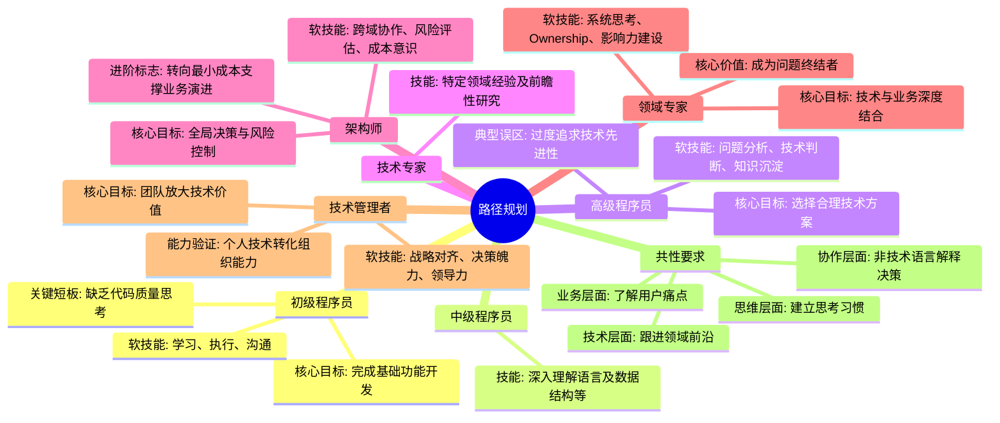

## 思维导图

## 路径

1. **初级程序员**  
   - 技能：掌握基础编程语言（如Java/Python/C++），熟悉开发工具及数据库基本操作，能实现简单功能模块。
2. **中级程序员**  
   - 技能：深入理解开发语言及数据结构，独立完成复杂功能开发，具备代码优化能力。
3. **高级程序员**  
   - 技能：精通技术栈（如分布式系统、缓存/队列中间件），能主导大型项目开发，解决技术难题。
4. **技术专家**  
   - 技能：在特定领域（如AI/大数据/安全）有6年以上经验，精通行业业务逻辑，具备技术前瞻性研究能力。
5. **架构师**  
   - 技能：系统架构设计能力，跨部门协调能力，熟悉高并发/高可用方案，掌握主流技术选型及优化。

## 关键能力

### **1. 初级程序员（实现能力阶段）**

- **核心目标**：完成基础功能开发  
- **硬技能要求**：  
  - 掌握至少一门编程语言（如Java/Python）的基础语法  
  - 熟悉开发工具链（IDE、Git、调试工具）  
  - 实现简单模块代码（如CRUD操作）  
- **软技能要求**：  
  - **学习能力**：快速理解需求文档  
  - **执行力**：按时交付指定任务  
  - **沟通反馈**：及时同步开发进度  

**关键短板**：仅关注“功能是否实现”，缺乏对代码质量、扩展性的思考。

---

### **2. 高级程序员（方案设计阶段）**

- **核心目标**：选择合理技术方案  
- **硬技能要求**：  
  - 掌握多种实现模式（如设计模式、缓存策略）  
  - 独立完成复杂模块开发（如分布式事务处理）  
  - 代码优化能力（性能调优、内存管理）  
- **软技能要求**：  
  - **问题分析**：从需求中拆解技术难点  
  - **技术判断**：权衡不同方案的短期/长期成本  
  - **知识沉淀**：输出技术文档或内部分享  

**典型误区**：过度追求“技术先进性”而忽略业务适配性。

---

### **3. 架构师（系统思维阶段）**

- **核心目标**：全局技术决策与风险控制  
- **硬技能要求**：  
  - 主导系统架构设计（微服务/单体架构选型）  
  - 高并发/高可用方案实施（如熔断降级、分库分表）  
  - 技术债务治理与重构策略  
- **软技能要求**：  
  - **跨域协作**：协调开发、测试、运维团队  
  - **风险评估**：预判技术方案的潜在问题（如扩展性瓶颈）  
  - **成本意识**：计算硬件/人力投入ROI  

**进阶标志**：从“实现功能”转向“用最小成本支撑业务演进”。

---

### **4. 领域专家（业务落地阶段）**

- **核心目标**：技术与业务深度结合  
- **硬技能要求**：  
  - 精通垂直领域技术栈（如电商系统的库存算法、支付对账）  
  - 制定技术标准与规范（如代码审查机制、DevOps流程）  
  - 前沿技术预研与落地（如AIGC在业务场景的应用）  
- **软技能要求**：  
  - **系统思考**：理解技术决策对业务指标的长期影响  
  - **Ownership**：对交付结果负全责（如保障系统SLA≥99.99%）  
  - **影响力建设**：培养团队技术氛围，输出行业级解决方案  

**核心价值**：成为“问题终结者”——业务方提出的需求或问题，能直接给出可行性方案而非转交他人。

---

### **5. 技术管理者（资源整合阶段）**

- **核心目标**：通过团队放大技术价值  
- **硬技能要求**：  
  - 技术路线规划（3-5年技术演进蓝图）  
  - 资源调配能力（预算分配、跨部门协作）  
- **软技能要求**：  
  - **战略对齐**：将技术能力转化为公司竞争优势  
  - **决策魄力**：在不确定信息下快速拍板（如技术栈切换时机）  
  - **领导力**：激发团队成员潜力，建立技术梯队  

**能力验证**：能否将个人技术能力转化为可复用的组织能力（如搭建中台系统、建立技术委员会）。

---

## **共性要求**

- **技术层面**：持续跟进领域前沿（如定期阅读论文、参与技术大会）  
- **业务层面**：深入一线了解用户痛点（避免“技术自嗨”）  
- **思维层面**：建立“第一性原理”思考习惯（追问技术选择的本质原因）  
- **协作层面**：用非技术语言向业务方解释技术决策（降低沟通成本）  
