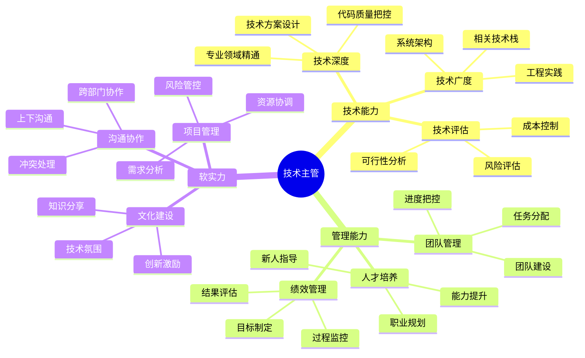

## 技能图谱

## 🎯 岗位介绍

技术主管是连接管理层和研发团队的桥梁，负责团队的技术方向把控和日常管理工作。

## 💡 核心技能

### 技术能力

1. **技术深度**
   - 专业技术精通
   - 技术方案设计
   - 代码质量控制
   - 技术难题攻关

2. **技术管理**
   - 技术选型决策
   - 架构设计评审
   - 研发流程优化
   - 技术债务管理

### 管理能力

1. **团队管理**
   - 任务分配与跟进
   - 团队建设与激励
   - 技术氛围营造
   - 绩效目标管理

2. **人才培养**
   - 新人培养体系
   - 技术能力提升
   - 职业发展规划
   - 知识体系建设

## 📚 学习资源

1. **技术提升**
   - 《架构整洁之道》
   - 《技术管理之道》
   - 《团队协作方法论》

2. **管理提升**
   - 《第一线管理》
   - 《OKR工作法》
   - 《高效能人士的七个习惯》

## 🛠️ 必备工具

1. **管理工具**
   - JIRA/禅道
   - Confluence
   - GitLab

2. **协作工具**
   - 飞书/钉钉
   - 腾讯会议/Zoom
   - Slack

3. **开发工具**
   - Code Review工具
   - 持续集成平台
   - 代码质量平台

## 📈 职业发展

### 发展路径
1. 高级工程师（3-5年）
2. 技术主管（5-7年）
3. 技术经理（7年+）

### 能力指标
- 技术：架构设计与评审能力
- 管理：团队管理与建设能力
- 业务：业务理解与推动能力

## 🎯 成长建议

1. **技术提升**
   - 保持技术敏锐度
   - 建立技术影响力
   - 把控技术方向

2. **管理能力**
   - 提升团队管理
   - 加强人才培养
   - 优化研发流程

3. **软实力**
   - 提升沟通能力
   - 加强项目管理
   - 培养商业意识 