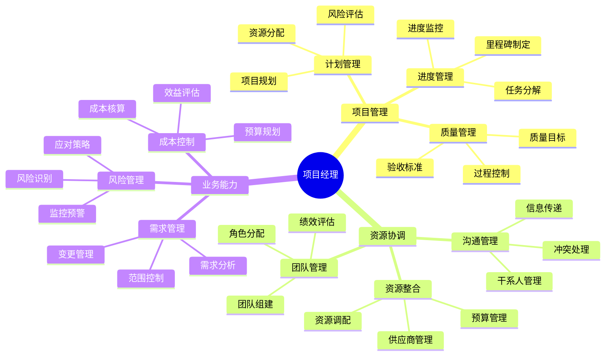

## 技能图谱

## 🎯 岗位介绍

项目经理负责项目的全生命周期管理，确保项目按时、按质、按预算完成。

## 💡 核心技能

### 项目管理

1. **计划与控制**
   - 项目规划制定
   - 资源分配优化
   - 进度监控管理
   - 质量目标把控

2. **风险管理**
   - 风险识别评估
   - 应对策略制定
   - 风险跟踪监控
   - 应急预案管理

### 管理能力

1. **团队管理**
   - 团队组建领导
   - 任务分配协调
   - 团队氛围营造
   - 冲突处理化解

2. **沟通管理**
   - 干系人管理
   - 跨部门协作
   - 向上管理能力
   - 信息传递把控

## 📚 学习资源

1. **项目管理**
   - 《PMBOK指南》
   - 《敏捷项目管理》
   - 《项目管理案例集》

2. **管理提升**
   - 《卓有成效的管理者》
   - 《关键对话》
   - 《项目管理之道》

## 🛠️ 必备工具

1. **项目管理**
   - Microsoft Project
   - JIRA
   - Trello

2. **协作工具**
   - Confluence
   - 飞书/钉钉
   - Slack

3. **分析工具**
   - Excel
   - PowerBI
   - 项目管理软件

## 📈 职业发展

### 发展路径
1. 助理项目经理（2-4年）
2. 项目经理（4-6年）
3. 高级项目经理（6-8年）
4. 项目总监（8年+）

### 能力指标
- 管理：项目全生命周期管理能力
- 业务：业务理解与价值实现能力
- 领导：团队领导与影响力

## 🎯 成长建议

1. **专业提升**
   - 获取PMP认证
   - 掌握敏捷方法
   - 积累项目经验

2. **管理能力**
   - 提升沟通技巧
   - 加强风险管理
   - 优化资源配置

3. **视野拓展**
   - 建立行业认知
   - 理解商业模式
   - 把握发展趋势 