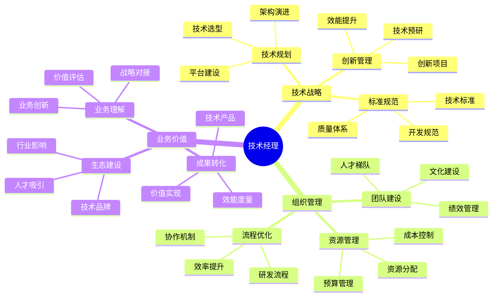

## 技能图谱

## 🎯 岗位介绍

技术经理/研发总监负责团队技术战略规划、组织建设和业务价值实现。

## 💡 核心技能

### 技术管理

1. **技术战略**
   - 技术路线规划
   - 架构演进决策
   - 技术创新管理
   - 标准规范制定

2. **平台建设**
   - 技术平台规划
   - 效能体系建设
   - 质量体系完善
   - 安全体系构建

### 组织管理

1. **团队建设**
   - 组织架构设计
   - 人才梯队建设
   - 技术文化塑造
   - 绩效体系优化

2. **资源管理**
   - 预算规划控制
   - 资源优化配置
   - 成本效益管理
   - 供应商管理

## 📚 学习资源

1. **技术管理**
   - 《CTO说》
   - 《技术管理之道》
   - 《技术领导力》

2. **管理提升**
   - 《德鲁克管理经典》
   - 《创新者的窘境》
   - 《组织能力构建》

## 🛠️ 必备工具

1. **管理工具**
   - OKR系统
   - 项目管理平台
   - 绩效考核系统

2. **技术工具**
   - 研发效能平台
   - 监控分析系统
   - 知识管理平台

3. **协作工具**
   - 团队协作平台
   - 文档管理系统
   - 沟通工具套件

## 📈 职业发展

### 发展路径
1. 技术经理（6-8年）
2. 研发总监（8-10年）
3. 技术副总裁（10年+）

### 能力指标
- 技术：技术战略规划能力
- 管理：组织建设与运营能力
- 业务：业务价值创造能力

## 🎯 成长建议

1. **技术视野**
   - 把握技术趋势
   - 深化技术理解
   - 建立技术体系

2. **管理能力**
   - 提升组织管理
   - 加强资源整合
   - 优化运营效率

3. **商业洞察**
   - 理解商业模式
   - 创造业务价值
   - 建设技术品牌 