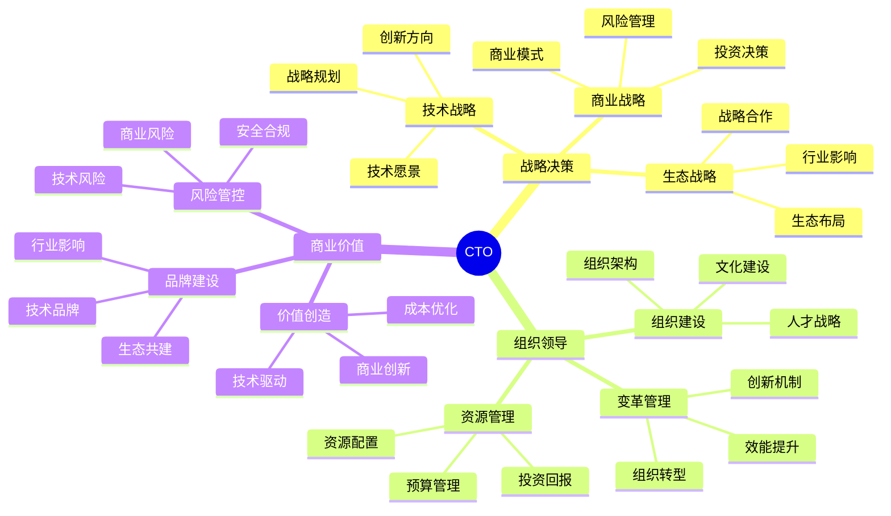

## 技能图谱

## 🎯 岗位介绍

CTO/技术副总裁是公司技术战略的制定者和执行者，负责技术与业务的深度融合，驱动公司创新发展。

## 💡 核心技能

### 战略能力

1. **技术战略**
   - 技术愿景规划
   - 创新方向把控
   - 技术投资决策
   - 架构演进规划

2. **商业战略**
   - 商业模式创新
   - 技术价值转化
   - 投资回报评估
   - 风险管理决策

### 领导力

1. **组织管理**
   - 技术组织建设
   - 人才战略规划
   - 文化价值塑造
   - 变革管理推动

2. **生态建设**
   - 技术生态布局
   - 战略合作管理
   - 行业标准制定
   - 开源社区建设

## 📚 学习资源

1. **战略管理**
   - 《技术战略论》
   - 《创新者的解答》
   - 《颠覆式创新》

2. **领导力提升**
   - 《从技术到管理》
   - 《商业模式新生代》
   - 《战略管理》

## 🛠️ 必备工具

1. **战略分析**
   - 战略规划工具
   - 商业分析系统
   - 决策支持系统

2. **管理工具**
   - OKR管理平台
   - 企业管理系统
   - 数据分析平台

3. **协作工具**
   - 高管协作平台
   - 战略管理系统
   - 商务沟通工具

## 📈 职业发展

### 发展路径
1. 技术副总裁（10-15年）
2. CTO（15年+）
3. CEO（战略性晋升）

### 能力指标
- 战略：技术战略规划与执行能力
- 管理：组织领导与变革管理能力
- 商业：商业价值创造与实现能力

## 🎯 成长建议

1. **战略思维**
   - 培养全局视野
   - 加强战略思考
   - 提升决策能力

2. **领导力**
   - 建设高效组织
   - 打造创新文化
   - 发展战略伙伴

3. **商业洞察**
   - 把握行业趋势
   - 创造商业价值
   - 建立品牌影响力 