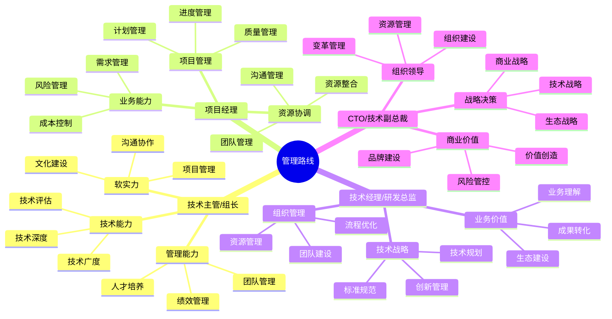

## 思维导图

## 🧭 职业导航

### 基层管理

- [技术主管](./01tech-leader.md) - 连接管理层和研发团队的桥梁
- [项目经理](./02project-manager.md) - 项目全生命周期的掌舵者

### 中高层管理

- [技术经理](./03tech-manager.md) - 技术团队的领航者
- [CTO](./04cto.md) - 技术战略的制定者和执行者

## 💡 核心能力要求

### 基层管理阶段

1. **技术主管/组长**
   - 技术深度与广度
   - 团队管理能力
   - 项目管理能力
   - 沟通协作能力

2. **项目经理**
   - 项目规划能力
   - 资源协调能力
   - 风险管理能力
   - 沟通管理能力

### 中高层管理阶段

1. **技术经理/研发总监**
   - 技术战略规划
   - 组织建设能力
   - 资源管理能力
   - 业务价值创造

2. **CTO/技术副总裁**
   - 战略决策能力
   - 组织领导能力
   - 商业价值创造
   - 生态建设能力

## 🌟 成功要素

- **技术视野**: 保持技术敏锐度
- **管理能力**: 提升组织效能
- **商业洞察**: 创造业务价值
- **领导力**: 建设高效团队

## 📈 发展建议

1. **技术积累**
   - 建立技术深度
   - 拓展技术广度
   - 保持技术敏感

2. **管理能力**
   - 提升团队管理
   - 加强资源整合
   - 优化运营效率

3. **商业思维**
   - 理解商业模式
   - 把握行业趋势
   - 创造商业价值

4. **领导力建设**
   - 塑造团队文化
   - 建设人才梯队
   - 提升影响力
