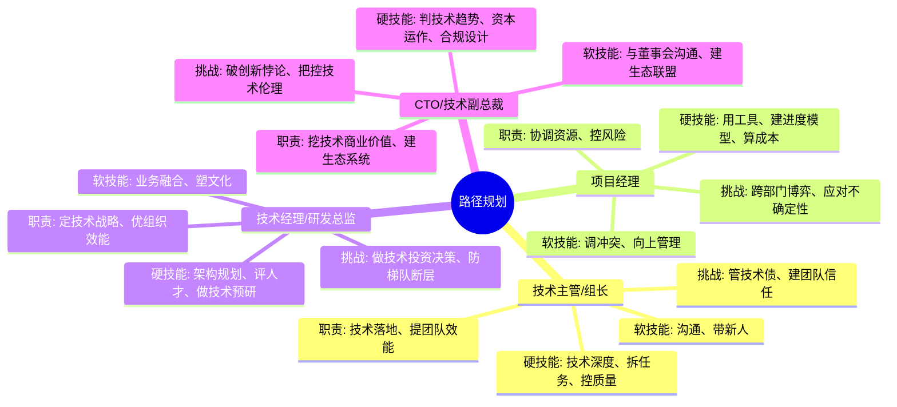

## 思维导图

## 路径

1. **技术主管/组长**  
   - 技能：任务拆解与分配能力，团队协作经验，技术指导能力。
2. **项目经理**  
   - 技能：项目管理（PMP认证优先），需求沟通与进度把控，跨团队协调能力。
3. **技术经理/研发总监**  
   - 技能：技术团队管理、技术方向规划、业务与技术的融合能力。
4. **CTO/技术副总裁**  
   - 技能：行业战略眼光，技术商业化能力，公司级资源协调与决策能力。

## 关键能力

### **1. 技术主管/组长（基层管理）**

**核心职责**：技术落地执行 + 团队效能提升  

- **硬技能**：  
  → 技术深度：精通至少1个技术栈（如Java全栈开发）  
  → 任务拆解：将需求转化为可执行的开发任务清单  
  → 质量管控：代码审查/性能优化等具体操作能力  
- **软技能**：  
  → 沟通翻译：将技术语言转化为产品/业务部门能理解的内容  
  → 新人培养：制定个性化成长路径（如针对算法工程师设计3个月进阶计划）  
**关键挑战**：  
■ 技术债管理：平衡短期交付压力与长期代码质量  
■ 团队信任建立：通过技术示范（如亲自攻克复杂模块）树立权威  

---

### **2. 项目经理（中层管理过渡）**

**核心职责**：资源协调 + 风险控制  

- **硬技能**：  
  → 工具运用：熟练使用Jira/禅道等项目管理工具  
  → 进度建模：建立关键路径图（CPM）预测项目瓶颈  
  → 成本核算：人力/设备/外包费用的动态测算能力  
- **软技能**：  
  → 冲突调解：处理开发与测试团队的工时争议  
  → 向上管理：用数据化报告同步进展（如每周红黄绿灯预警机制）  
**关键挑战**：  
■ 跨部门博弈：在技术可行性、业务需求、运营资源之间寻找平衡点  
■ 不确定性应对：突发需求变更时的资源重分配策略  

---

### **3. 技术经理/研发总监（中高层管理）**

**核心职责**：技术战略制定 + 组织效能优化  

- **硬技能**：  
  → 架构规划：设计可扩展的技术中台（如微服务治理体系）  
  → 人才评估：建立工程师能力模型（如T型技能雷达图）  
  → 技术预研：组织前沿技术可行性验证（如AIGC在现有产品的应用测试）  
- **软技能**：  
  → 业务耦合：理解市场部GMV目标对技术投入的影响  
  → 文化塑造：通过技术分享会/黑客马拉松提升团队凝聚力  
**关键挑战**：  
■ 技术投资决策：在自研与采购之间做出ROI最优解（如选择云服务还是自建IDC）  
■ 梯队断层预防：建立关键岗位AB角机制（如核心系统负责人强制带徒制度）  

---

### **4. CTO/技术副总裁（高层决策）**

**核心职责**：技术商业价值挖掘 + 生态系统构建  

- **硬技能**：  
  → 技术趋势预判：把握3-5年后的技术拐点（如量子计算对加密体系的影响）  
  → 资本运作：技术资产评估（如专利组合的商业化估值）  
  → 合规设计：构建符合GDPR/网络安全法的技术架构  
- **软技能**：  
  → 董事会沟通：用非技术语言解释技术战略（如将区块链技术转化为供应链金融故事）  
  → 生态联盟：主导技术标准制定（如参与行业API接口规范编写）  
**关键挑战**：  
■ 创新悖论突破：平衡现有技术栈维护与颠覆性创新投入（参考案例：诺基亚塞班系统转型教训）  
■ 技术伦理把控：制定AI算法的道德审查机制（如人脸识别技术的使用边界）  

---

### **能力演进对照表**

| 管理层级 | 技术技能权重 | 人际技能权重 | 概念技能权重 | 典型决策场景示例 |  
|----------|-------------|-------------|-------------|----------------|  
| 技术主管 | 60%         | 30%         | 10%         | 选择SpringBoot还是Go语言实现新模块 |  
| 项目经理 | 40%         | 45%         | 15%         | 是否接受产品经理提出的需求变更 |  
| 研发总监 | 30%         | 40%         | 30%         | 未来三年技术栈演进路线图规划 |  
| CTO      | 15%         | 35%         | 50%         | 评估收购AI初创公司的技术整合风险 |  

---

### **关键突破点提醒**

1. **基层→中层**：需完成从「个人贡献者」到「团队放大器」的思维转变，重点提升任务拆解颗粒度（如将「优化系统性能」拆解为20个具体子任务）  
2. **中层→高层**：必须建立技术-商业双重视角，例如评估技术方案时同步计算专利布局可能性  
3. **危机处理能力**：越高层级越需要「模糊决策」能力，参考某大厂CTO在数据泄露事件中，需在48小时内决策：技术修复、公关应对、法律预案的优先级排序  
