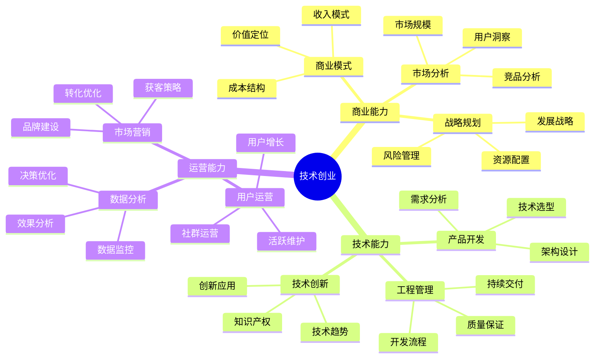

## 技能图谱

## 🎯 创业方向

### 产品导向
1. **工具软件**
   - 开发者工具
   - 效率工具
   - 专业软件

2. **SaaS服务**
   - 企业服务
   - 行业解决方案
   - 云服务平台

### 服务导向
1. **技术服务**
   - 定制开发
   - 技术咨询
   - 系统集成

2. **创新服务**
   - AI应用
   - 区块链服务
   - 物联网解决方案

## 💡 核心能力

### 商业能力

1. **商业模式设计**
   - 价值主张设计
   - 商业模式创新
   - 盈利模式设计
   - 成本结构优化

2. **市场战略**
   - 市场定位
   - 竞争策略
   - 营销策略
   - 渠道建设

### 技术能力

1. **产品研发**
   - 技术架构
   - 开发管理
   - 质量保证
   - 持续交付

2. **创新能力**
   - 技术创新
   - 产品创新
   - 专利保护
   - 技术趋势

## 📚 学习资源

1. **创业指南**
   - 《精益创业》
   - 《从0到1》
   - 《商业模式新生代》

2. **技术提升**
   - 《架构即未来》
   - 《技术管理之道》
   - 《创新者的窘境》

## 🛠️ 必备工具

1. **开发工具**
   - 开发框架
   - 云服务平台
   - DevOps工具

2. **管理工具**
   - 项目管理
   - 团队协作
   - 数据分析

3. **运营工具**
   - 营销工具
   - 用户分析
   - 客户管理

## 📈 发展阶段

### 1. 准备期（3-6个月）
- 市场调研
- 产品规划
- 技术储备
- 资源准备

### 2. 启动期（6-12个月）
- MVP开发
- 产品验证
- 用户获取
- 模式验证

### 3. 成长期（1-2年）
- 产品迭代
- 市场扩张
- 团队建设
- 融资规划

### 4. 规模期（2年+）
- 规模化运营
- 品牌建设
- 生态构建
- 商业创新

## 🎯 成功要素

1. **产品战略**
   - 找准市场痛点
   - 产品差异化
   - 快速迭代验证
   - 用户体验至上

2. **技术战略**
   - 技术选型合理
   - 架构可扩展
   - 质量有保证
   - 持续技术创新

3. **商业战略**
   - 清晰商业模式
   - 合理定价策略
   - 有效获客渠道
   - 健康收入结构

## 💪 风险管理

1. **财务风险**
   - 现金流管理
   - 成本控制
   - 收入多元化
   - 融资规划

2. **市场风险**
   - 市场变化
   - 竞争对手
   - 用户需求
   - 政策法规

3. **技术风险**
   - 技术选型
   - 研发风险
   - 安全风险
   - 维护成本 