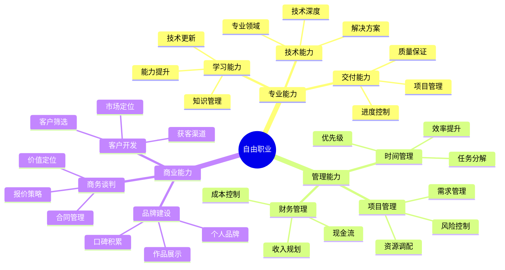

## 技能图谱

## 🎯 发展方向

### 技术服务
1. **远程开发**
   - 项目外包
   - 技术支持
   - 定制开发

2. **技术咨询**
   - 架构设计
   - 技术评审
   - 性能优化

### 知识变现
1. **内容创作**
   - 技术写作
   - 视频教程
   - 在线课程

2. **技术培训**
   - 企业培训
   - 个人辅导
   - 研讨会

## 💡 核心能力

### 专业能力

1. **技术能力**
   - 技术深度
   - 方案设计
   - 问题解决
   - 质量保证

2. **交付能力**
   - 需求理解
   - 进度管理
   - 质量控制
   - 文档输出

### 商业能力

1. **客户管理**
   - 客户开发
   - 需求沟通
   - 关系维护
   - 价值传递

2. **商务能力**
   - 项目评估
   - 报价策略
   - 合同管理
   - 谈判技巧

## 📚 学习资源

1. **技术提升**
   - 专业技术书籍
   - 在线学习平台
   - 技术社区

2. **商业提升**
   - 《自由职业设计》
   - 《定价策略》
   - 《客户开发》

## 🛠️ 必备工具

1. **开发工具**
   - 开发环境
   - 版本控制
   - 协作工具

2. **管理工具**
   - 时间管理
   - 项目管理
   - 文档协作

3. **商务工具**
   - CRM系统
   - 财务工具
   - 合同模板

## 📈 发展阶段

### 1. 准备期（3-6个月）
- 技能储备
- 作品准备
- 客户网络
- 平台入驻

### 2. 起步期（6-12个月）
- 接单实践
- 积累口碑
- 流程优化
- 品牌建设

### 3. 成长期（1-2年）
- 客户筛选
- 价格提升
- 服务升级
- 收入稳定

### 4. 成熟期（2年+）
- 品牌溢价
- 被动推荐
- 知识产品
- 收入多元

## 🎯 成功要素

1. **专业实力**
   - 技术精进
   - 解决问题
   - 持续学习
   - 经验积累

2. **商业思维**
   - 价值定位
   - 市场洞察
   - 商业模式
   - 品牌建设

3. **职业素养**
   - 诚信守时
   - 沟通能力
   - 责任心
   - 自我管理

## 💪 风险管理

1. **收入风险**
   - 收入规划
   - 现金储备
   - 收入来源多元化
   - 合理定价

2. **时间风险**
   - 时间管理
   - 工作边界
   - 生活平衡
   - 健康管理

3. **职业风险**
   - 能力更新
   - 市场变化
   - 竞争应对
   - 法律保护

## 🌟 特别建议

1. **起步阶段**
   - 从副业开始
   - 积累项目经验
   - 建立行业口碑
   - 构建客户网络

2. **成长阶段**
   - 提升专业能力
   - 优化服务流程
   - 建设个人品牌
   - 开发知识产品

3. **持续发展**
   - 保持技术敏感度
   - 关注市场变化
   - 优化商业模式
   - 建立被动收入 