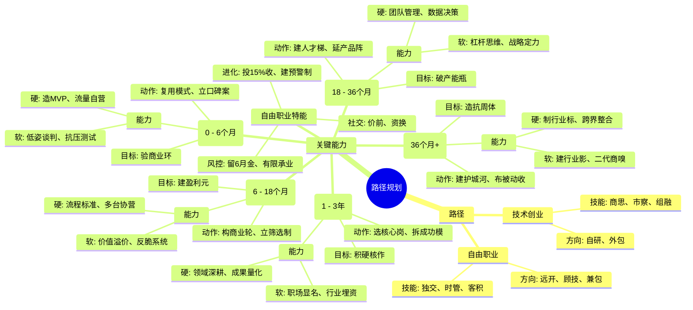

## 思维导图

## 路径

1. **技术创业**  
   - 技能：商业思维、市场洞察力、团队组建与融资能力。  
   - 方向：开发自有产品（如工具软件/SaaS）、外包公司。  
2. **自由职业/SOHO**  
   - 技能：独立交付能力，时间管理，客户资源积累。  
   - 方向：远程开发、技术顾问、兼职外包。  

## 关键能力

### **阶段一：职场蓄能期（1-3年）**

- **核心目标**：积累可市场化的硬核作品  
- **能力重点**：  
  - **硬技能**：  
    ▸ 垂直领域深度技能（如百万粉丝账号运营能力）  
    ▸ 可量化成果建设（阅读量10w+作品集/行业奖项）  
  - **软技能**：  
    ▸ 职场能见度塑造（主动争取核心项目机会）  
    ▸ 行业资源预埋（与上下游合作方建立信任）  
- **关键动作**：  
  → 选择能接触核心业务的岗位（参考案例中的"带百万粉丝大号"策略）  
  → 系统性拆解成功模式（如账号底层运转逻辑、变现路径）  

---

### **阶段二：冷启动期（0-6个月）**

- **核心目标**：完成最小商业闭环验证  
- **能力重点**：  
  - **硬技能**：  
    ▸ 最小可行性产品（MVP）打造（如标准化课程框架）  
    ▸ 流量自运营能力（同时跑通小红书+私域转化路径）  
  - **软技能**：  
    ▸ 低姿态谈判能力（首批客户可接受5折内测价）  
    ▸ 抗压测试（应对连续3个月无稳定收入的心理建设）  
- **关键动作**：  
  → 复用已验证模式（参考案例中"将公司培训经验迁移至C端教学"）  
  → 建立早期口碑案例（如帮助10个学员实现写作变现）  

---

### **阶段三：生存扩张期（6-18个月）**

- **核心目标**：建立可复制的盈利单元  
- **能力重点**：  
  - **硬技能**：  
    ▸ 流程标准化（SOP文档体系/自动化工具链搭建）  
    ▸ 多平台协同运营（知乎内容引流+知识星球交付）  
  - **软技能**：  
    ▸ 价值溢价包装（从教技能升级为"个人IP打造方法论"）  
    ▸ 反脆弱系统建设（ABZ收入模型：课程+咨询+社群）  
- **关键动作**：  
  → 构建商业飞轮（参考案例中"自产自销闭环"：内容→涨粉→课程→盈利）  
  → 建立筛选机制（拒绝非目标客户，聚焦高净值用户）  

---

### **阶段四：规模复制期（18-36个月）**

- **核心目标**：突破个人产能瓶颈  
- **能力重点**：  
  - **硬技能**：  
    ▸ 团队管理能力（远程协作/外包团队品控）  
    ▸ 数据化决策（LTV/CAC等财务模型应用）  
  - **软技能**：  
    ▸ 杠杆思维（用资本/技术放大个人时间价值）  
    ▸ 战略定力（抵抗短期快钱诱惑，如拒绝割韭菜型合作）  
- **关键动作**：  
  → 建立人才梯队（培养能执行SOP的助教团队）  
  → 产品矩阵延伸（如基础课→高阶训练营→企业内训）  

---

### **阶段五：生态构建期（36个月+）**

- **核心目标**：打造抗周期商业体  
- **能力重点**：  
  - **硬技能**：  
    ▸ 行业标准制定能力（如开发写作能力测评体系）  
    ▸ 跨界资源整合（与出版社/教育平台联合认证）  
  - **软技能**：  
    ▸ 行业影响力建设（担任大赛评委/出版书籍）  
    ▸ 第二代商业嗅觉（预判AI写作工具带来的模式变革）  
- **关键动作**：  
  → 建立护城河（参考案例中"课程+账号+行业背书"三位一体）  
  → 布局被动收入（开发自动化工具/版权内容授权）  

---

### **自由职业者特殊能力项**

1. **向上社交实践指南**：  
   - 价值前置原则：帮大咖整理演讲逐字稿/做课程脑图后再求指导  
   - 资源置换策略：用专业技能换取行业情报（如为投资人做内容优化）  
2. **风险控制铁律**：  
   - 保持6个月现金流储备  
   - 用有限责任主体承接业务（个体户/工作室注册）  
3. **持续进化机制**：  
   - 每年投入15%收入进行认知升级（高端社群/私董会）  
   - 建立"技能衰退预警系统"（如写作领域需每半年更新案例库）  
