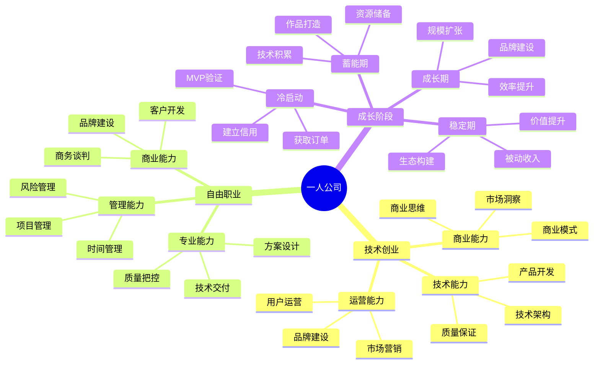

## 思维导图

## 🧭 职业导航

### 创业方向

- [技术创业](./01tech-startup.md) - 从0到1打造自己的产品和公司
- [自由职业](./02freelancer.md) - 成为一名成功的自由职业者

## 💡 核心能力要求

### 技术创业

1. **商业能力**
   - 商业模式设计
   - 市场需求分析
   - 产品战略规划
   - 融资与财务

2. **技术能力**
   - 产品研发
   - 技术架构
   - 质量保证
   - 运维支持

3. **运营能力**
   - 市场营销
   - 用户运营
   - 品牌建设
   - 渠道拓展

### 自由职业

1. **专业能力**
   - 技术深度
   - 项目交付
   - 质量保证
   - 持续学习

2. **管理能力**
   - 时间管理
   - 项目管理
   - 风险控制
   - 资源调配

3. **商业能力**
   - 客户开发
   - 商务谈判
   - 品牌建设
   - 价值定位

## 🌟 成长阶段

### 1. 蓄能期（1-3年）
- 目标：积累硬核作品
- 重点：技术深耕、成果量化
- 行动：选择核心赛道、构建竞争力

### 2. 冷启动期（0-6个月）
- 目标：验证商业模式
- 重点：MVP打造、获取订单
- 行动：快速迭代、建立信用

### 3. 成长期（6-18个月）
- 目标：建立盈利模式
- 重点：效率提升、规模扩张
- 行动：流程标准化、品牌建设

### 4. 稳定期（18个月+）
- 目标：构建护城河
- 重点：被动收入、价值提升
- 行动：产品矩阵、生态构建

## 📈 成功要素

1. **风险控制**
   - 保持6个月现金储备
   - 建立应急预案
   - 分散收入来源

2. **效率提升**
   - 流程自动化
   - 工具效能
   - 时间管理

3. **持续进化**
   - 技能更新
   - 市场洞察
   - 商业嗅觉

## 🎯 发展建议

1. **起步阶段**
   - 选择合适赛道
   - 积累核心作品
   - 建立行业资源

2. **成长阶段**
   - 标准化交付
   - 打造品牌
   - 扩大影响力

3. **进阶阶段**
   - 构建护城河
   - 开发被动收入
   - 建设生态系统
