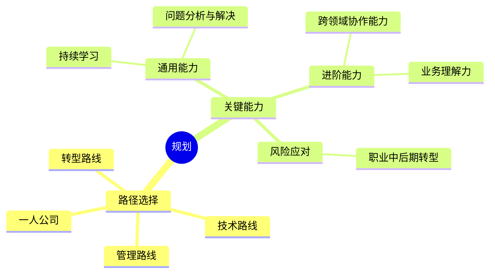

## 路径选择

- [技术路线](/expert/path)
- [管理路线](/manage/path)
- [转型路线](/cross/path)
- [一人公司](/one/path)

---

## 关键能力

- **通用能力**：持续学习（跟进新技术）、问题分析与解决能力。  
- **进阶能力**：业务理解力（避免纯技术思维）、跨领域协作能力。  
- **风险应对**：职业中后期需向“系统模式”转型，将技术能力转化为可扩展的商业产品或服务。  
