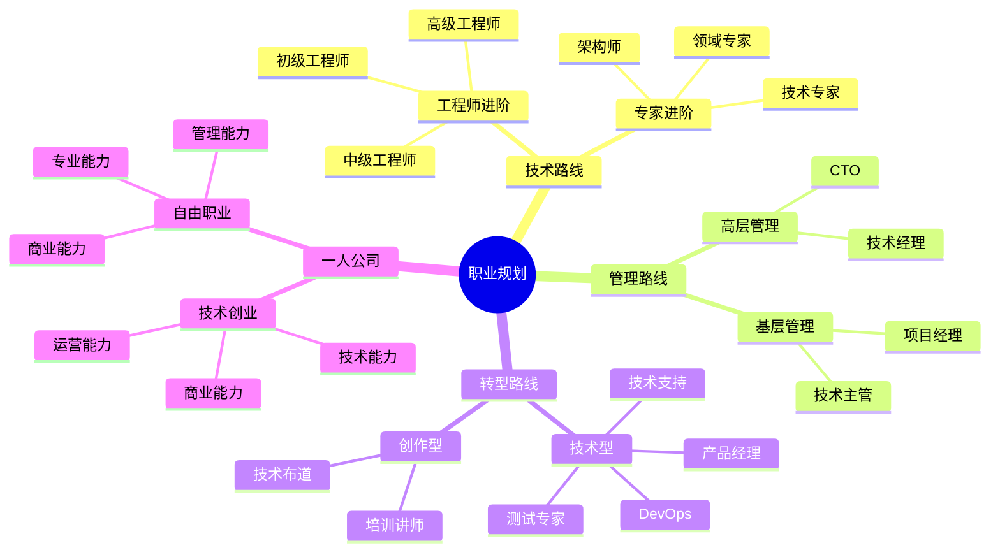

## 🧭 路径选择

### 1. [技术路线](/expert/path)

- 适合人群：热爱技术、追求技术深度
- 发展方向：工程师 → 技术专家 → 架构师 → 领域专家
- 核心要求：持续学习、技术创新、系统思维

### 2. [管理路线](/manage/path)

- 适合人群：善于沟通、组织协调能力强
- 发展方向：技术主管 → 技术经理 → 研发总监 → CTO
- 核心要求：团队管理、项目管理、战略思维

### 3. [转型路线](/cross/path)

- 适合人群：寻求突破、跨界思维强
- 发展方向：产品经理、测试专家、DevOps、技术布道等
- 核心要求：学习能力、适应能力、专业技能

### 4. [一人公司](/one/path)

- 适合人群：追求自由、创业精神强
- 发展方向：技术创业、自由职业
- 核心要求：全栈能力、商业思维、风险管理

## 💡 关键能力

### 1. 通用能力

- **持续学习**：技术更新、知识扩展、终身学习
- **问题解决**：分析能力、解决方案、创新思维
- **沟通协作**：团队协作、跨部门沟通、表达能力

### 2. 进阶能力

- **业务理解**：商业模式、行业认知、价值创造
- **系统思维**：架构设计、全局观、战略规划
- **领导力**：团队建设、资源整合、影响力

### 3. 风险应对

- **技术转型**：技术栈更新、领域转换、能力升级
- **职业转型**：角色转换、跨界发展、创业准备
- **终身发展**：核心竞争力、可持续性、价值提升

## 🌟 选择建议

1. **了解自我**
   - 评估个人特点和优势
   - 明确职业发展诉求
   - 认清能力差距

2. **选择路径**
   - 结合个人特点
   - 考虑市场需求
   - 评估发展空间

3. **制定计划**
   - 设定阶段性目标
   - 规划学习路径
   - 持续复盘调整
