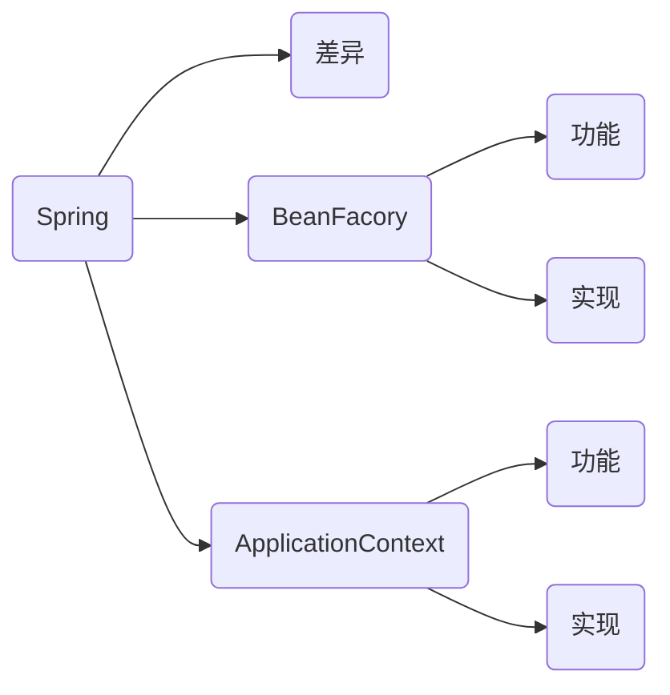

## 导图



## 差异

`org.springframework.beans` 和 `org.springframework.context` 是Spring框架IoC容器的基础包。 `BeanFactory` 接口提供了一种高级配置机制，能够管理任何类型的对象。ApplicationContext是BeanFactory的子接口，添加了如下功能：

- 更容易与Spring的AOP功能集成
- 消息资源处理（用于国际化）
- 事件发布
- 特定应用层的上下文，如用于web应用程序的WebApplicationContext

<table>
<caption class="title">Table 9. Feature Matrix</caption>
<colgroup>
<col style="width: 50%;">
<col style="width: 25%;">
<col style="width: 25%;">
</colgroup>
<thead>
<tr>
<th >Feature</th>
<th ><code>BeanFactory</code></th>
<th ><code>ApplicationContext</code></th>
</tr>
</thead>
<tbody>
<tr>
<td ><p>Bean instantiation/wiring Bean的实例化和自动装配</p></td>
<td ><p>Yes</p></td>
<td ><p>Yes</p></td>
</tr>
<tr>
<td ><p>Integrated lifecycle management 集成bean生命周期管理</p></td>
<td ><p>No</p></td>
<td ><p>Yes</p></td>
</tr>
<tr>
<td ><p>Automatic <code>BeanPostProcessor </code> registration Bean后置处理器自动注册</p></td>
<td ><p>No</p></td>
<td ><p>Yes</p></td>
</tr>
<tr>
<td ><p>Automatic <code>BeanFactoryPostProcessor</code> registration BeanFactory后置处理器自动注册</p></td>
<td ><p>No</p></td>
<td ><p>Yes</p></td>
</tr>
<tr>
<td ><p>Convenient <code>MessageSource</code> access (for internationalization) 国际化资源访问</p></td>
<td ><p>No</p></td>
<td ><p>Yes</p></td>
</tr>
<tr>
<td ><p>Built-in <code>ApplicationEvent</code> publication mechanism 内置事件发布机制</p></td>
<td ><p>No</p></td>
<td ><p>Yes</p></td>
</tr>
</tbody>
</table>

## 常见实现

ApplicationContext：

- AnnotationConfigApplicationContext 基于注解配置的A加载上下文
- ClassPathXmlApplicationContext 基于xml配置的加载上下文
- FileSystemXmlApplicationContext 基于xml配置的加载上下文
- GenericApplicationContext 通用的上下文，更加灵活加载配置

BeanFactory：

- DefaultListableBeanFactory 默认BeanFactory

## 代码示例

beanFactory 不会做的事情：

1. 不会主动调用 beanFactory的后处理器
2. 不会主动添加Bean的后处理器
3. 不会主动初始化单例
4. 不会解析beanFactory，还不会解析 ${} 占位符 #{} EL表达式

通过 `DefaultListableBeanFactory` 实现 ApplicationContext的功能：

```java
package engineer.spring.ioc.context;

import javax.annotation.Resource;

public class AppBeanFactory {

    protected final Log log = LogFactory.getLog(getClass());

    public static void main(String[] args) {
        DefaultListableBeanFactory beanFactory = new DefaultListableBeanFactory();
        // bean的定义 初始化 销毁 class scope 生命周期定义
        AbstractBeanDefinition beanDefinition = BeanDefinitionBuilder.genericBeanDefinition(Config.class)
                .setScope(BeanDefinition.SCOPE_SINGLETON).getBeanDefinition();
        beanFactory.registerBeanDefinition("config", beanDefinition);

        // 给beanFactory添加常用的后置处理器
        // 设置排序方法
        AnnotationConfigUtils.registerAnnotationConfigProcessors(beanFactory);
        // beanFactory 执行后置处理器类 补充一些bean的定义
        beanFactory.getBeansOfType(BeanFactoryPostProcessor.class).values().stream().sorted(beanFactory.getDependencyComparator()).forEach(beanFactoryPostProcessor -> {
            System.out.println("BeanFactoryPostProcessor: " + beanFactoryPostProcessor.getClass());
            beanFactoryPostProcessor.postProcessBeanFactory(beanFactory);
        });

        // bean 执行后置处理器类 补充一些bean的扩展处理  如 @autowired @resource
        beanFactory.getBeansOfType(BeanPostProcessor.class).values().forEach(beanPostProcessor -> {
            System.out.println("BeanPostProcessor: " + beanPostProcessor.getClass());
            beanFactory.addBeanPostProcessor(beanPostProcessor);
        });

        // 预处理单例类
        beanFactory.preInstantiateSingletons();

        System.out.println(beanFactory.getBean(Bean1.class).getBean2());


        for (String beanDefinitionName : beanFactory.getBeanDefinitionNames()) {
            System.out.println(beanDefinitionName);
        }

        // beanFactory 后处理器有排序的逻辑
        System.out.println(beanFactory.getBean(Bean1.class).getInter());

    }

    @Configuration
    static class Config {
        @Bean
        public Bean1 bean1() {
            return new Bean1();
        }

        @Bean
        public Bean2 bean2() {
            return new Bean2();
        }

        @Bean
        public Bean3 bean3() {
            return new Bean3();
        }

        @Bean
        public Bean4 bean4() {
            return new Bean4();
        }
    }

    static class Bean1 {
        @Autowired
        private Bean2 bean2;
        @Autowired
        @Resource(name = "bean4")
        private Inter bean3;

        public Bean1() {
            System.out.println("Bean1构造器初始化");
        }

        public Bean2 getBean2() {
            return bean2;
        }

        public Inter getInter() {
            return bean3;
        }
    }

    static class Bean2 {
        public Bean2() {
            System.out.println("Bean2构造器初始化");
        }
    }

    interface Inter {
    }

    static class Bean3 implements Inter {

    }

    static class Bean4 implements Inter {

    }
}


```

## 参考

- [1.16.1. BeanFactory or ApplicationContext?](https://docs.spring.io/spring-framework/docs/5.3.x/reference/html/core.html#resources)